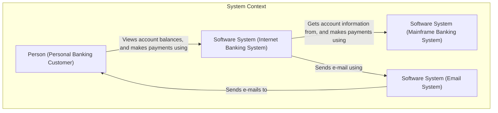
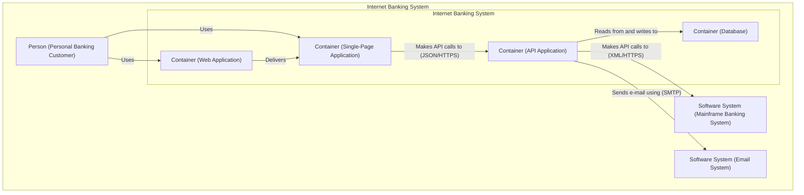
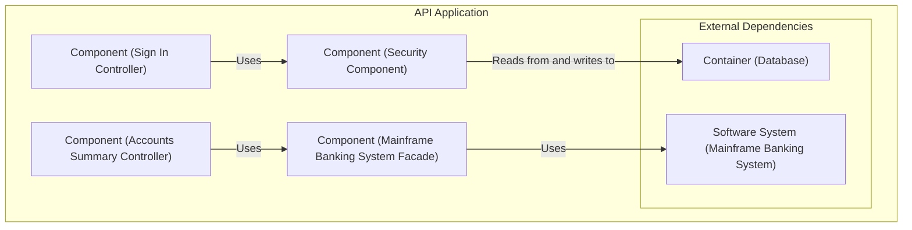
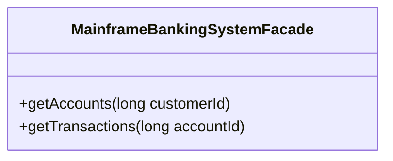
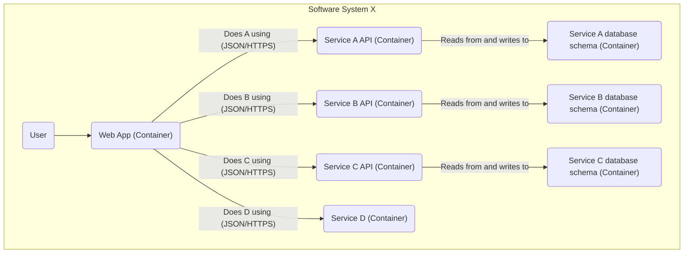
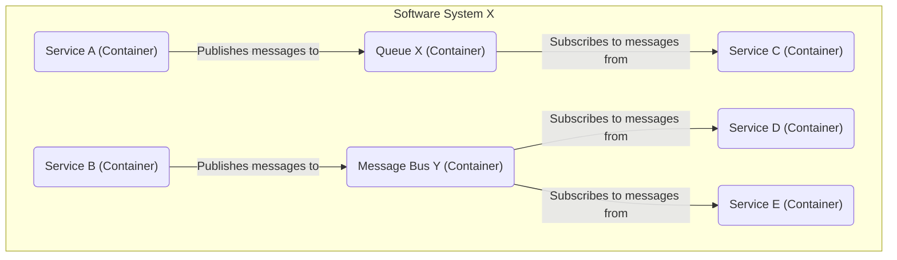

# C4 Model for Software System Design

## Introduction

The C4 model is a lean graphical notation system for modeling the architecture of software systems. It was created by Simon Brown as a way to help software development teams describe and communicate software architecture, both during up-front design sessions and when retrospectively documenting an existing codebase. The C4 model is essentially a way to create "maps" of your code, at various levels of detail, similar to how you might use Google Maps to zoom in and out of a geographical area.

The main goal of the C4 model is to provide a structured and hierarchical way to visualize software architecture, making it easier for different audiences (from non-technical stakeholders to developers) to understand the system's design.

## The 4 Levels

The C4 model consists of four core diagram types, each providing a different level of detail.

### Level 1 – System Context Diagram

A System Context diagram is the highest level of abstraction and provides a starting point for understanding a software system. It shows the system as a black box in the center, surrounded by its users and the other systems it interacts with.

**Main Points:**
*   **Scope:** A single software system.
*   **Elements:** The system in scope, people (users, actors), and external software systems.
*   **Audience:** Everybody, including non-technical stakeholders.
*   **Purpose:** To show the system in its environment, without revealing internal details.

**Mermaid Example:**

### Level 2 – Container Diagram

The Container diagram zooms into the software system, showing the high-level technical building blocks. In the C4 model, a **container** represents an application or a data store. It is a separately deployable or runnable unit that executes code or stores data. Examples include:

*   **Server-side web applications:** A Java, .NET, or Node.js application running in a web server.
*   **Client-side web applications:** A JavaScript application running in a user's web browser (e.g., Angular, React).
*   **Client-side desktop applications:** A native desktop application (e.g., WPF, Swift/Objective-C).
*   **Mobile apps:** An iOS or Android app.
*   **Databases:** A schema or database in a relational or non-relational database management system.
*   **File systems:** A directory or folder in a file system.

**Main Points:**
*   **Scope:** A single software system.
*   **Elements:** Containers (applications, data stores) within the system, plus people and external systems.
*   **Audience:** Technical people (developers, architects, operations).
*   **Purpose:** To show the high-level shape of the architecture and technology choices.

**Mermaid Example:**

### Level 3 – Component Diagram

The Component diagram zooms into an individual container, showing the components inside it. A component is a grouping of related functionality encapsulated behind a well-defined interface.

**Main Points:**
*   **Scope:** A single container.
*   **Elements:** Components within the container, plus other containers, people, and external systems.
*   **Audience:** Software architects and developers.
*   **Purpose:** To show how a container is built from smaller, cohesive blocks of functionality.

**Mermaid Example:**

### Level 4 – Code Diagram

The Code diagram is the lowest level of detail, zooming into an individual component to show how it is implemented in code. This level is optional and often generated on-demand by IDEs.

**Main Points:**
*   **Scope:** A single component.
*   **Elements:** Code elements (classes, interfaces, functions, etc.).
*   **Audience:** Software architects and developers.
*   **Purpose:** To show the implementation details of a component.

**Mermaid Example:**

## More Use Cases

### Microservices

The C4 model does not treat microservices as a special case. A microservice is typically a separate, runnable process, which means it can be modeled as a **container** in a C4 diagram. If you have a system built from microservices, your container diagram would show these microservices as individual containers, illustrating how they interact with one another and with other systems.

### Message Bus, Queues, and Topics

For asynchronous communication, such as with a message bus, you can model this in a few ways:

*   **As a Software System:** If the message bus is a shared, central enterprise service, you can model it as an external software system that your containers interact with.
*   **As a Container:** If the message bus is specific to the system you are modeling, you can show it as a container within your system boundary. The queues or topics can be shown as labels on the relationships between containers.

## How to Use It in Practice

Here are some practical tips for using the C4 model:

*   **Tooling:** You can use a variety of tools to create C4 diagrams. For long-lived documentation, a "diagrams as code" approach using tools like **Mermaid** or **PlantUML** is highly effective, as it allows you to version control your diagrams alongside your source code.
*   **Documentation Strategy:** Don't feel obligated to create all four levels of diagrams for every system. A System Context diagram is highly recommended for all systems. Container diagrams are also very useful. Component and Code diagrams should be created only when they add significant value.
*   **Keep it Simple:** The goal of the C4 model is to create clear and easy-to-understand diagrams. Avoid cluttering your diagrams with unnecessary details.

## References

*   **Official Website:** [c4model.com](https://c4model.com)
