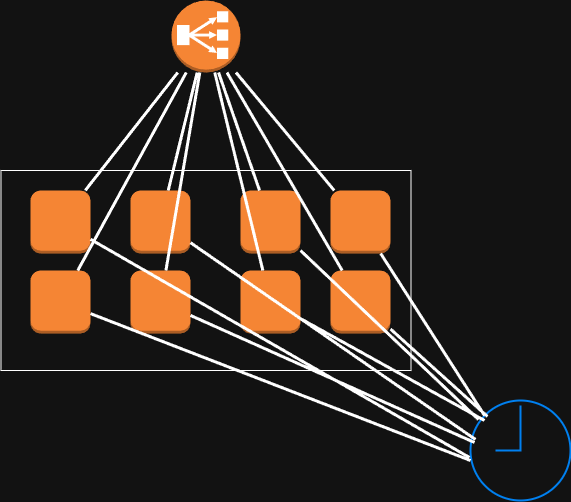

# Design Pattern: Timestamp

This pattern addresses one of the most fundamental challenges in a distributed system: getting all nodes to agree on the time. This is essential for ensuring that events can be ordered correctly across the entire system.

## The Problem: Event Ordering

In a distributed system, different services run on different machines, each with its own internal clock. These clocks can drift apart, a phenomenon known as **clock skew**.

**Why is this a problem?**

-   **Debugging and Tracing:** If you are trying to trace a user's actions (e.g., `add_to_cart` followed by `checkout`), and the events are logged with incorrect timestamps from unsynchronized servers, it becomes impossible to determine the correct sequence of events.
-   **Business Logic:** Many features rely on time. For example, a system might need to know if a user's session has expired. If the servers involved have different times, this calculation becomes unreliable.
-   **Data Consistency:** In some systems, the last write wins. If the system cannot agree on which write was last, data corruption can occur.

The goal of the Timestamp pattern is to ensure all nodes in the system have a synchronized clock, within an acceptable margin of error (the "delta").

## The Solution: Centralized Time Service

A common and effective way to implement time synchronization is to create a dedicated, centralized **Time Service**.

### Architecture

The architecture consists of three main parts:

1.  **Application Nodes:** These are the servers running the actual business logic of your distributed system.
2.  **Time Service Cluster:** A cluster of simple, lightweight servers whose only responsibility is to report the correct time. A load balancer sits in front of this cluster to distribute requests.
3.  **Master Time Source:** The servers in the Time Service Cluster must synchronize themselves against a highly accurate, authoritative source, such as an **Atomic Clock** or an NTP (Network Time Protocol) server.

### How it Works (Pull Model)

1.  At a regular interval (e.g., every minute), each Application Node sends a request to the Time Service's load balancer asking, "What time is it?"
2.  The load balancer forwards the request to one of the time servers in the cluster.
3.  The time server returns the current, accurate time.
4.  The Application Node updates its own internal clock with the time it received.

This pull-based model scales well because the responsibility for synchronization is initiated by the clients, preventing the Time Service from having to manage connections to thousands of nodes.

### Implementation Considerations

-   **Update Frequency:** How often should nodes sync their time? This depends on two factors:
    -   The natural **clock drift** of your hardware (how quickly the clocks become inaccurate).
    -   The business requirement for accuracy (the acceptable **delta**).

-   **Blocking vs. Non-Blocking Synchronization:**
    -   **Non-Blocking (Default):** The application node updates its clock in the background while continuing to serve requests. This is suitable for most systems.
    -   **Blocking:** The application node takes itself offline, synchronizes its clock, and then comes back online. This is critical for systems where even a small time discrepancy is unacceptable (e.g., financial systems processing transactions). This is often performed during a scheduled maintenance window.

## Alternative Approaches

While a centralized time service is common, other approaches exist:

-   **Log Annotation with Machine Learning:** Instead of synchronizing clocks in real-time, analyze logs after the fact. An ML model can infer the causal relationship between events to determine their logical order, even if the timestamps are skewed.
-   **Decoupling Services (Dependancy Total Separation):** If possible, design services to be so independent that they don't need to agree on time. This is not always feasible.

## Diagram

