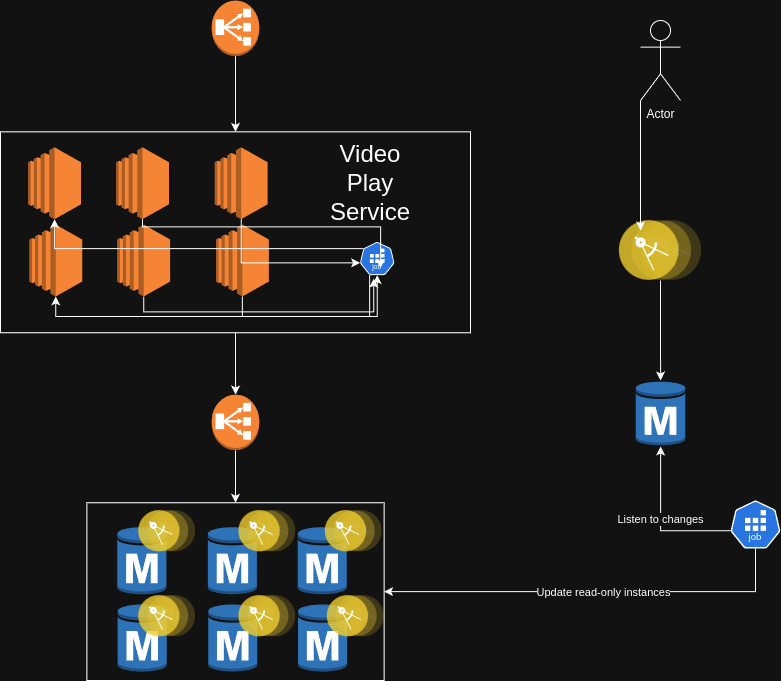

# Design Pattern: Command Query Responsibility Segregation (CQRS)

CQRS is a powerful architectural pattern that separates the model for writing data (Commands) from the model for reading data (Queries). This separation allows each model to be optimized independently for its specific task.

## The Problem: A Single Model for Reads and Writes

In many traditional architectures, a single data model is used for both querying and updating a database. This unified model often leads to compromises:

-   **Complexity:** The model must support both read and write operations, which can have very different requirements, leading to a complex, bloated design.
-   **Performance Bottlenecks:** The needs of high-throughput write operations can conflict with the needs of complex query operations. Optimizing for one often degrades the performance of the other.
-   **Scalability Issues:** It's difficult to scale the read and write workloads independently. You are forced to scale the entire service, even if only one aspect (e.g., reads) is experiencing heavy load.

## The Solution: Separate Models

CQRS addresses this by splitting the application into two distinct parts:

1.  **The Command Side:** This part of the application handles all create, update, and delete operations. It is focused on processing commands that change the state of the system. The command model is optimized for validation, business logic, and transactional consistency.

2.  **The Query Side:** This part of the application handles all read operations. It is focused on retrieving data and presenting it to the user. The query model is optimized for efficient querying and can be denormalized into a format that is perfect for display, avoiding complex joins and calculations.

### How it Works

A typical CQRS architecture looks like this:

-   A client sends a **Command** to the command side of the application.
-   The command handler processes the command, runs business logic, and updates the primary data store (the "write database").
-   The changes to the write database are then published as **Events**.
-   A separate process listens for these events and uses them to update a dedicated **"read database"**. This read database is denormalized and specifically designed to serve the application's queries efficiently.
-   When a client needs to read data, it sends a **Query** directly to the query side, which reads from the optimized read database.

### CQRS and Event Sourcing

CQRS is very commonly used with the **Event Sourcing** pattern. In this combination:

-   The **write model** doesn't store the current state at all. It simply writes events to an event log.
-   The **query model** is built by projecting these events into a denormalized read store. This makes the query side a highly flexible and powerful reporting tool.

### Benefits

-   **Independent Scaling:** You can scale the number of servers for your read and write workloads independently.
-   **Optimized Data Models:** The read and write models can be tailored to their specific tasks, leading to simpler designs and better performance.
-   **Flexibility:** You can have multiple, different query models for the same write model, serving the needs of different clients (e.g., a mobile app vs. a reporting dashboard).

# Diagram

