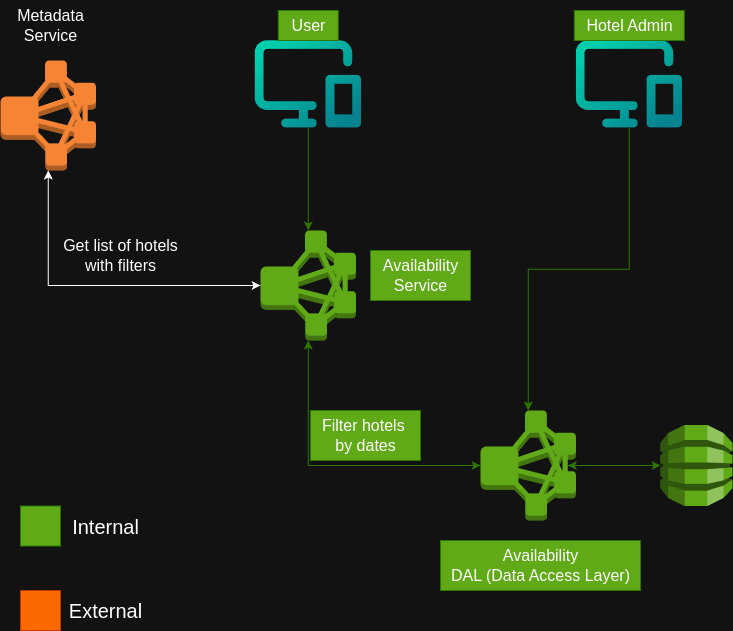

# System Design Example: Hotel Availability Service

This document walks through the design of a hotel availability service, following the **3-Points System** framework. The goal is to build a system similar to the core of Booking.com or Expedia.

--- 

## Stage 1: The Tactical Questions (The WHY)

-   **Question:** What is the goal? Are we building a niche B2B tool or a general-purpose competitor to Expedia?
-   **Answer:** The goal is to build a general-purpose, consumer-facing system.

-   **Question:** What specific part of the system should we focus on?
-   **Answer:** We will focus on the **Availability Subsystem**. This is the core component responsible for finding and updating hotel room availability.

--- 

## Stage 2: The Strategic Questions (The WHAT)

-   **Question:** What are the functional requirements for this subsystem?
-   **Answer:** The service must provide two main capabilities:
    1.  **Querying Availability:**
        -   An API to search for available hotels based on filters (e.g., city, amenities) and a date range.
        -   An API to get the list of available rooms for a *specific* hotel and date range.
    2.  **Updating Availability:**
        -   An API for hotel administrators to manually mark rooms as available or unavailable, accounting for bookings made outside our system (e.g., walk-ins).

-   **Question:** Are there any constraints or clarifications?
-   **Answer:**
    -   All search filters (e.g., pool, parking) apply at the **hotel level**, not the room level.
    -   We are allowed to use cloud services (e.g., AWS).

--- 

## Stage 3: The Operational Questions (The HOW)

### High-Level Logical Diagram

The system consists of two types of users (the end-user and the hotel admin) and two main services:

1.  **Availability Service:** Our core service that handles all the business logic.
2.  **Metadata Service:** An external service that stores static hotel data (e.g., name, address, amenities). This data changes infrequently and can be heavily cached.

### Query Flow

1.  A user queries for hotels in Cairo with a pool.
2.  The **Availability Service** first calls the **Metadata Service** to get a list of all hotel IDs in Cairo that have a pool.
3.  The **Availability Service** then queries its own **Availability Database** to see which of those hotels have rooms available for the user's chosen dates.
4.  The service returns a list of available hotels.

### Data Model for Availability

It is more efficient to store **bookings** (which have a start and end date) rather than **availability** (which can be fragmented).

-   To check if a hotel is available, we can run a query like: `SELECT COUNT(DISTINCT room_id) FROM bookings WHERE hotel_id = ? AND date_range_overlaps(?, ?)`.
-   If the result is less than the total number of rooms in the hotel, we know there is availability.

### Update Flow

-   A **Hotel Admin** uses a portal or API to directly update the **Availability Database**. They can add a booking record to mark a room as unavailable or delete one to make it available.

### Scaling the System

-   **Read/Write Separation (CQRS-like):** The user query path (read) is separate from the admin update path (write).
-   **Sharding:** The Availability Database must be sharded, for example by country or region. Updates require locks, and sharding limits the scope of these locks to a small subset of the data, which is critical for performance.
-   **Handling Real-Time Updates:** When an admin updates a room's availability, that change must be reflected in user searches immediately. This presents a consistency challenge.
    -   **The Problem:** If we have multiple read replicas, how do we update them all instantly without locking the whole system?
    -   **The Solution (Trade-off):** Instead of trying for a perfect, instantaneous update across all replicas (which is very difficult), we can use a trick. When an update for a specific hotel begins:
        1.  Mark that single hotel as "temporarily unavailable" in a distributed cache (like Redis).
        2.  Update the primary database.
        3.  Propagate the changes to all the read replicas.
        4.  Once all replicas are updated, remove the "unavailable" flag from the cache.

    This approach makes a single hotel briefly un-queryable, which is a much better user experience than making the entire system slow or unresponsive during updates.
