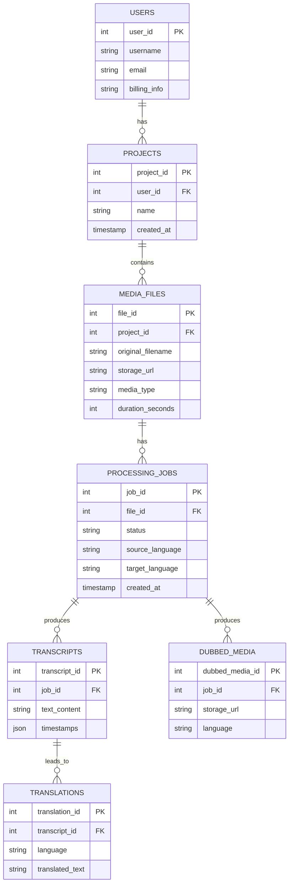
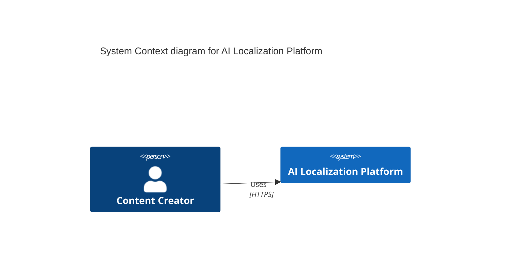
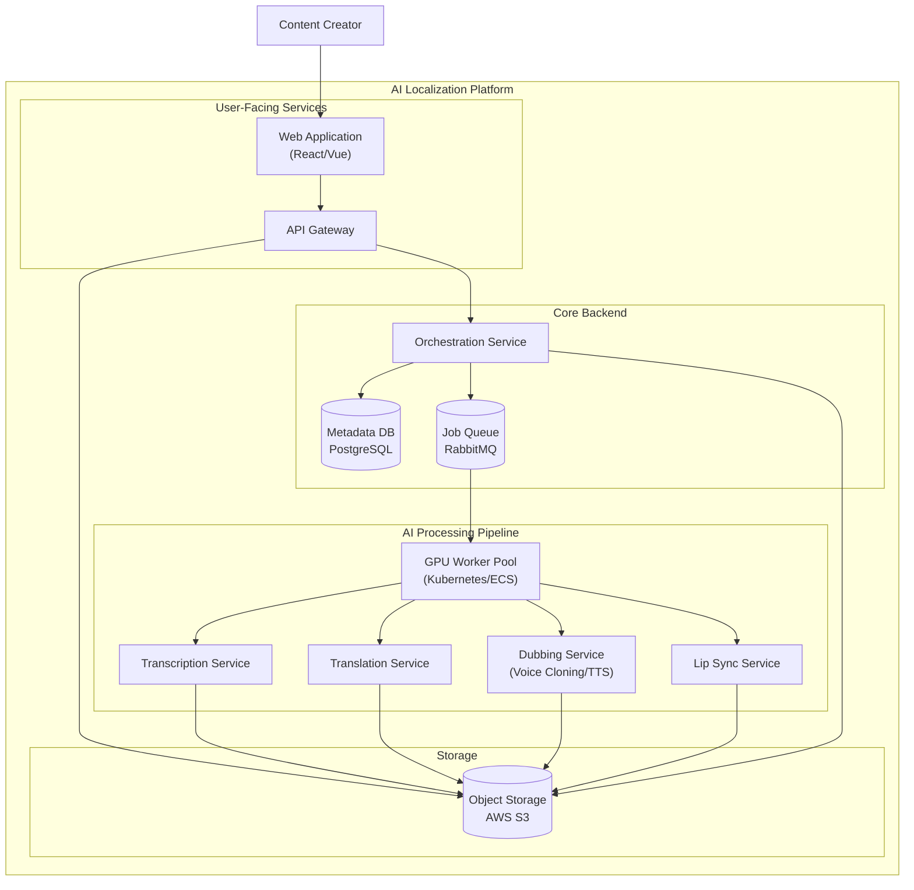
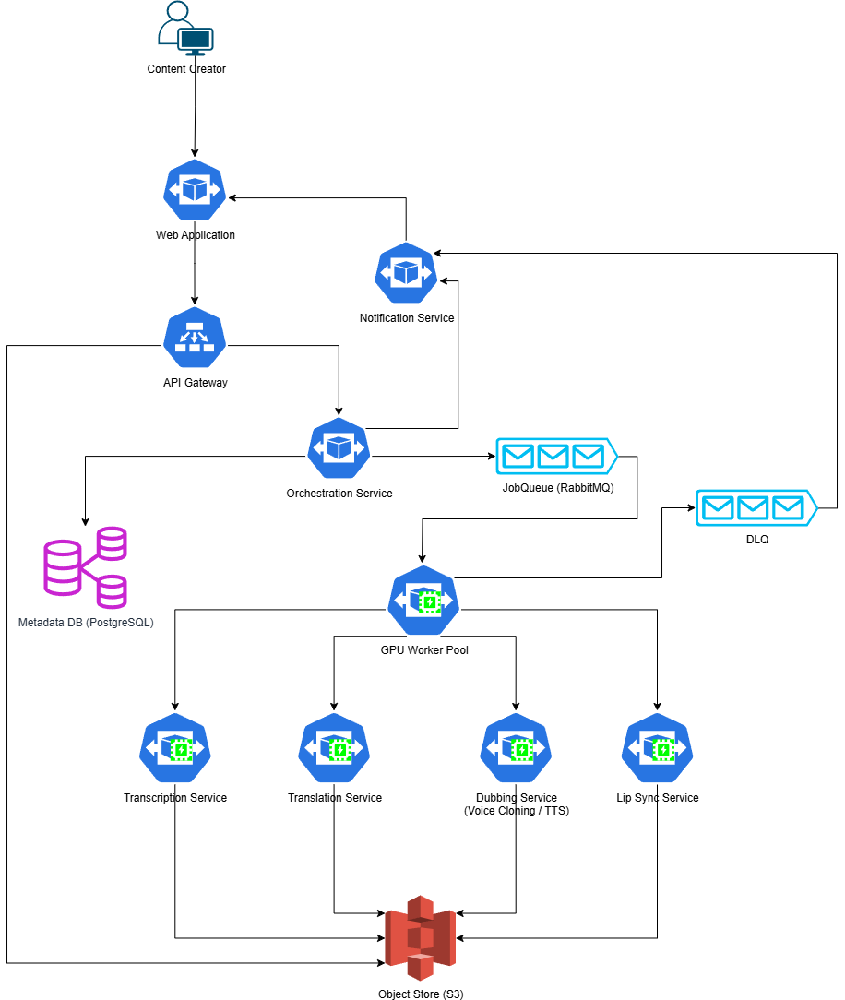

# System Design: AI-Powered Dubbing and Localization Platform (like Camb.AI)

## 1. Introduction

Camb.AI is a generative AI platform specializing in hyper-realistic, zero-shot dubbing and translation for audio and video content. It enables content creators, sports leagues, and entertainment companies to localize their content for a global audience by translating it into numerous languages while preserving the original speaker's voice, tone, and emotion.

This document outlines the system architecture for a scalable, high-fidelity platform capable of processing large volumes of media for AI-powered localization.

## 2. Requirements

### 2.1. Functional Requirements

-   **Media Upload**: Users can upload audio and video files in various formats (e.g., MP3, WAV, MP4, MOV).
-   **Transcription Service**: Automatically transcribe the source audio into text with high accuracy.
-   **Translation Service**: Translate the source transcription into multiple target languages, supporting colloquialisms and context.
-   **Voice Cloning & Dubbing**: The core feature. Generate dubbed audio in the target language that preserves the original speaker's voice characteristics (prosody, emotion, accent).
-   **Lip Sync (for Video)**: Automatically adjust the lip movements in the video to match the newly generated dubbed audio.
-   **Media Processing Pipeline**: A workflow to manage the entire process: transcription -> translation -> dubbing -> lip sync -> final output generation.
-   **Project Management**: Users can create and manage projects, track the status of processing jobs, and view results.
-   **User Management & Billing**: Secure user authentication, authorization, and a billing system based on usage (e.g., minutes processed).

### 2.2. Non-Functional Requirements

-   **High Availability**: The platform must be highly available for media uploads and job management. The processing pipeline should be resilient to failures.
-   **Scalability**: The system must scale to handle a high volume of concurrent media processing jobs, which are computationally expensive (GPU-intensive).
-   **High Fidelity**: The generated audio must be of high quality, with natural-sounding voices and accurate emotional transfer.
-   **Durability**: User's original and processed media files must be stored securely and durably, with no data loss.
-   **Low Processing Latency**: While not a real-time system, the end-to-end processing time for a media file should be as low as possible to provide a good user experience.
-   **Security**: Protect user-uploaded content from unauthorized access, both in transit and at rest.

## 3. Capacity Estimations and Constraints

This platform is compute-intensive, with storage and processing needs dominated by media files and GPU-based AI models.

### Assumptions

-   **Active Users**: 1,000 active users (e.g., content studios, media houses).
-   **Media Processed per User**: 10 minutes of video per day on average.
-   **Average Video Bitrate**: 5 Mbps (for high-quality source files).
-   **AI Processing Ratio**: 1 minute of video requires 5 minutes of processing time on a standard GPU (e.g., NVIDIA T4 or A10G).
-   **Storage Overhead**: Intermediate files (transcripts, audio stems) and final outputs add 100% storage overhead per project.

### Calculations

**Daily Processing Load:**
-   Total minutes processed per day: `1,000 users * 10 min/user = 10,000 minutes/day`

**GPU Compute Requirements:**
-   Total GPU time needed per day: `10,000 min_video * 5 min_gpu/min_video = 50,000 GPU minutes/day`
-   Equivalent GPU hours: `50,000 / 60 = ~833 GPU hours/day`
-   Number of GPUs required: `833 GPU hours / 24 hours = ~35 GPUs` running continuously.

**Storage Ingest per Day:**
-   Total hours of video per day: `10,000 min / 60 = ~167 hours/day`
-   Ingest rate: `167 hours * 3600 s/hr * 5 Mbps / 8 bits/byte = ~375 GB/day`

**Total Storage (1 year):**
-   Assuming 3x replication for durability and 100% overhead for processed files:
-   Total storage: `375 GB/day * 365 days * (1 + 1 for overhead) * 3 (replication) = ~821 TB/year`

**Bandwidth:**
-   Average upload bandwidth: `375 GB / (24 * 3600s) = ~4.3 MB/s`
-   Peak upload bandwidth (assuming 10x average): `4.3 MB/s * 10 = 43 MB/s`

### High-Level Estimate

| Type | Estimate |
| :---- | :------- |
| Daily Media Processed | 10,000 minutes |
| Concurrent GPUs Needed | ~35 |
| Daily Storage Ingest | 375 GB |
| Total Storage (1 Year) | ~821 TB |
| Peak Upload Bandwidth | 43 MB/s |

## 4. Data Model Design

The data model must track users, their projects, media files, and the status of complex, multi-stage processing jobs.

### 4.1. ERD Diagram

### 4.2. Database Choices

-   **Metadata Storage**: A relational database like **PostgreSQL** or **MySQL** is ideal for storing structured metadata about users, projects, files, and job statuses. It provides transactional integrity, which is crucial for managing the state of the processing pipeline.
-   **Media Storage**: All media files (original uploads, intermediate files, and final dubbed versions) should be stored in a highly durable and scalable object storage service like **AWS S3** or **Google Cloud Storage**. This separates the large, unstructured data from the metadata database.
-   **Job Queue**: A message queue like **RabbitMQ** or **AWS SQS** is essential for managing the asynchronous processing jobs. When a new job is created, it's pushed to a queue, and worker services consume tasks from this queue.

## 5. API Design

### 5.1. Client-facing API (REST)

The primary API for user interaction would be REST-based.

-   **Projects & Media**
    -   `POST /projects` - Create a new project.
    -   `POST /projects/{project_id}/media` - Upload a media file. This would likely return a pre-signed URL for a direct upload to object storage to bypass the API server.
-   **Processing Jobs**
    -   `POST /jobs` - Create a new dubbing job for a specific media file and target language.
    -   `GET /jobs/{job_id}` - Get the status, progress, and results of a job.
    -   `GET /jobs/{job_id}/result` - Download the final dubbed media file.

### 5.2. Internal APIs (gRPC)

For high-performance communication between internal microservices, gRPC is a better choice.

-   **Orchestrator -> Transcription Service**: `rpc StartTranscription(media_url)`
-   **Orchestrator -> Translation Service**: `rpc StartTranslation(transcript_text, target_language)`
-   **Orchestrator -> Dubbing Service**: `rpc StartDubbing(transcript_text, reference_audio_url, target_language)`

## 6. High-Level Architecture

The system is designed as a set of microservices orchestrated to perform a complex media processing pipeline. This approach allows for independent scaling of different components, especially the compute-intensive AI services.

### 6.1. C4 Context Diagram

### 6.2. C4 Container Diagram

This diagram shows the major services and data stores that make up the platform.

## 7. Detailed Design

### 7.1. Media Processing Pipeline

The core of the platform is an asynchronous, multi-stage pipeline managed by the Orchestration Service.

1.  **Upload**: The user uploads a media file via the web app. The web app gets a pre-signed URL from the API Gateway to upload the file directly to Object Storage (S3). This avoids overwhelming the backend services with large file transfers.
2.  **Job Creation**: Once the upload is complete, the web app notifies the backend, and the Orchestration Service creates a new job in the Metadata DB and places a message in the Job Queue.
3.  **Transcription**: A GPU worker from the pool picks up the transcription task. It downloads the media file from S3, runs the automatic speech recognition (ASR) model, and saves the resulting transcript (with timestamps) back to S3 and updates the job status in the Metadata DB.
4.  **Translation**: The Orchestrator, seeing the transcription is complete, places a translation task in the queue. A worker picks it up, runs the text through a translation model, and saves the result.
5.  **Dubbing**: The Orchestrator then queues the main dubbing task. A GPU worker loads the original audio (for voice cloning), the translated text, and the TTS model (like MARS5). It generates the dubbed audio and saves it to S3.
6.  **Lip Sync (Optional)**: If the source was a video, a lip-sync task is queued. A GPU worker uses the original video and the new dubbed audio to generate a new video file with synchronized lip movements.
7.  **Finalization**: The Orchestrator marks the job as complete and notifies the user (e.g., via email or a websocket push to the web app).

### 7.2. GPU Worker Pool

-   **Containerization**: All AI models (Transcription, Translation, Dubbing, etc.) are packaged into Docker containers.
-   **Orchestration**: A container orchestrator like **Kubernetes** is used to manage the pool of GPU-enabled nodes. This allows for auto-scaling the number of workers based on the length of the job queue.
-   **Job-Specific Workers**: We can have different node pools for different tasks. For example, dubbing might require high-end GPUs (like A100s), while transcription could use more cost-effective ones (like T4s).

### 7.3. Orchestration Service

-   **State Machine**: The Orchestrator acts as a state machine for each job. It uses the Metadata DB to track the current state of each job (e.g., `PENDING`, `TRANSCRIBING`, `DUBBING`, `COMPLETE`, `FAILED`).
-   **Resilience**: If a worker fails mid-task, the job can be retried automatically. The Orchestrator can implement exponential backoff for retries. For unrecoverable failures, the job is marked as `FAILED`, and the user is notified.
-   **Workflow Definition**: The pipeline workflow can be defined using a workflow engine like **AWS Step Functions** or a custom state machine implementation within the service itself.

## 8. Scalability and Resilience

### 8.1. Scalability

-   **Stateless Services**: The Web App, API Gateway, and Orchestration Service are stateless and can be scaled horizontally by adding more instances.
-   **GPU Worker Auto-Scaling**: This is the most critical part of scalability. The Kubernetes cluster managing the GPU workers can be configured with a Cluster Autoscaler. It can automatically add or remove GPU nodes from the pool based on the number of pending jobs in the Job Queue. This ensures we only pay for expensive GPU resources when they are needed.
-   **Database Scaling**: The metadata database can be scaled using read replicas to handle higher read loads for project management and job status dashboards. For write scaling, sharding by `user_id` or `project_id` can be implemented.
-   **Object Storage**: AWS S3 provides virtually unlimited scalability for media storage, handling ingest and delivery without capacity planning.

### 8.2. Resilience

-   **Job Retries**: If a worker fails while processing a job (e.g., due to a transient error or node failure), the Orchestration Service can automatically requeue the task. Using a message queue with acknowledgment semantics ensures that tasks are not lost.
-   **Dead-Letter Queue (DLQ)**: If a job fails repeatedly, it is moved to a DLQ. This prevents a single problematic job from blocking the queue and allows engineers to inspect and debug the failure manually.
-   **Idempotency**: All processing steps should be designed to be idempotent. If a task is run twice (e.g., due to a retry), it should not produce duplicate data or cause errors.
-   **Multi-AZ Deployment**: All components of the system, including databases, services, and worker nodes, should be deployed across multiple Availability Zones (AZs) to protect against a single AZ failure.

## 9. Bottlenecks and Resolutions

-   **GPU Availability and Cost**: A sudden spike in demand can lead to a shortage of available GPU instances, or costs can escalate quickly.
    -   **Resolution**: Use a mix of on-demand and spot instances for GPU workers. Spot instances are much cheaper but can be preempted. Design the system to handle spot instance interruptions gracefully by checkpointing long-running jobs.
-   **Complex Workflow Management**: As more processing steps are added, the Orchestration Service can become a complex monolith.
    -   **Resolution**: Use a dedicated workflow engine like AWS Step Functions or Cadence. These tools are designed to manage complex, long-running, and stateful workflows with built-in support for retries, error handling, and visibility.
-   **"Hot" Media Files**: A single large file or a project with thousands of files can put a strain on the pipeline.
    -   **Resolution**: The Orchestrator can break down large jobs into smaller parallelizable chunks. For example, a long video can be split into segments, transcribed and dubbed in parallel, and then stitched back together at the end.

## 10. Conclusion

This document outlines a robust and scalable system design for an AI-powered localization platform similar to Camb.AI. The architecture is built around a set of core principles to handle the unique challenges of high-volume, compute-intensive media processing.

Key design choices include:

-   An **asynchronous, microservices-based architecture** that decouples the user-facing services from the intensive backend processing pipeline.
-   A central **Orchestration Service** that manages the complex, multi-stage workflow, providing resilience through state tracking and retries.
-   A **scalable GPU Worker Pool**, managed by Kubernetes, that can auto-scale based on demand, optimizing for both performance and cost.
-   The separation of data storage, using a **relational database** for metadata, **object storage** for large media files, and a **message queue** for task management.

This design provides the foundation for a platform that is not only powerful and scalable but also resilient and cost-effective, capable of delivering high-fidelity AI-driven content localization to a global user base.