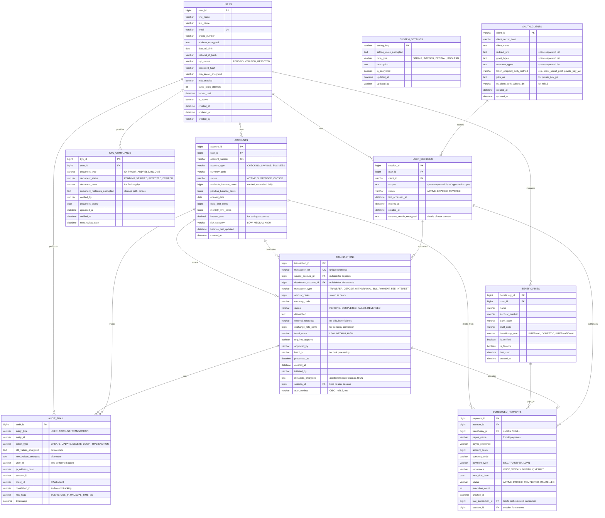
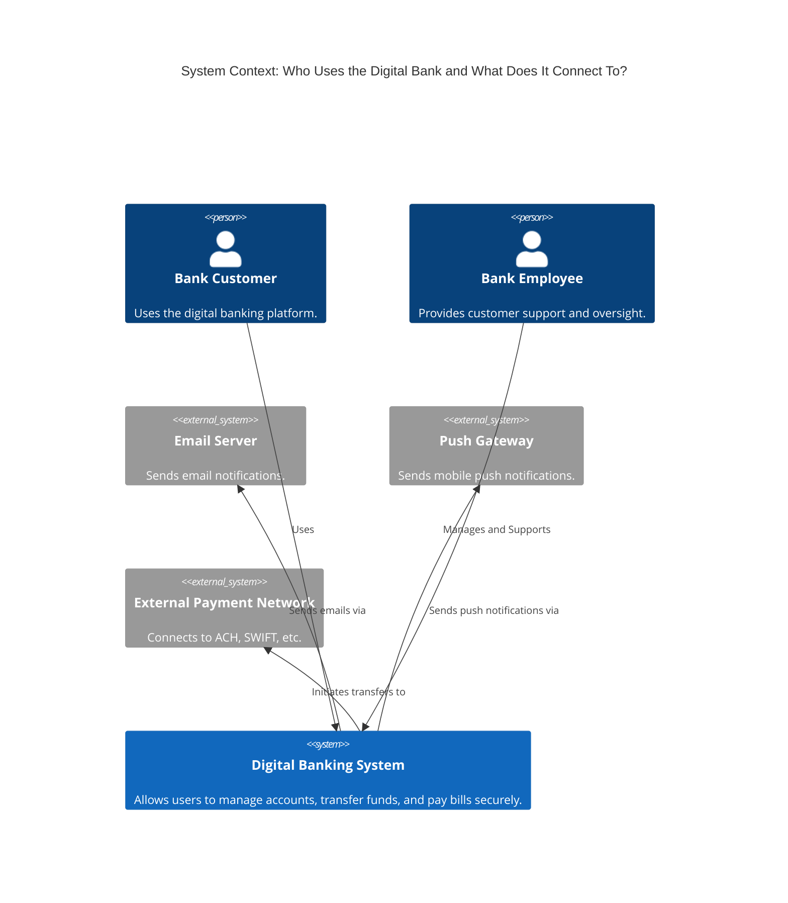
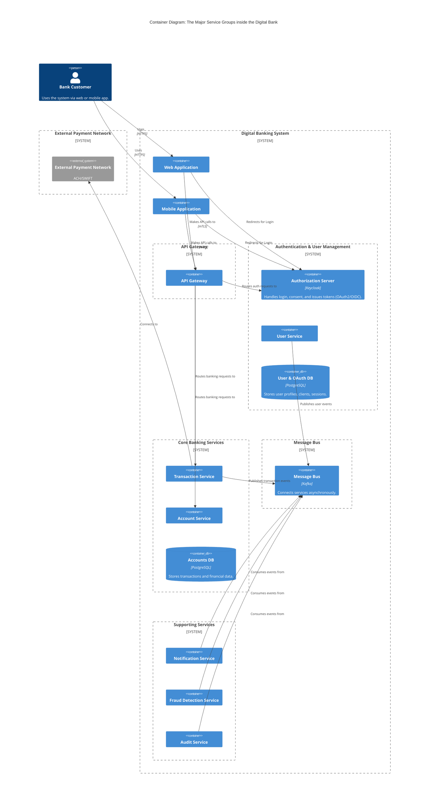
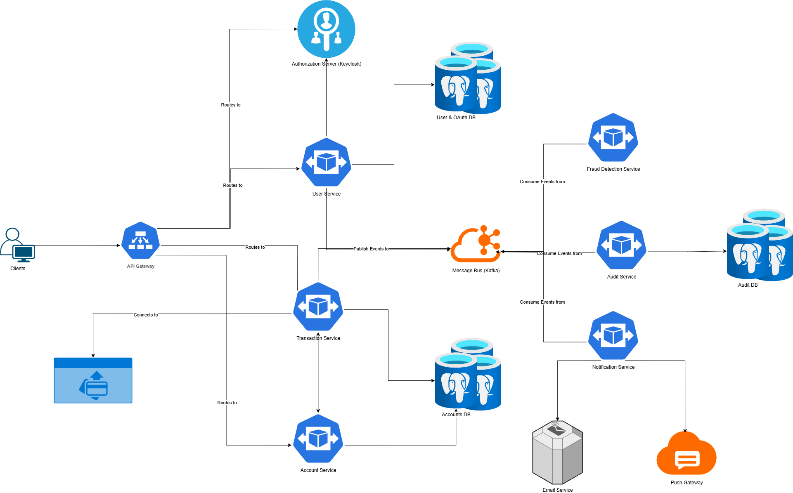

# Digital Banking System Design

## 1. Introduction & Goals

### 1.1. What is a Digital Banking System?

A digital banking system is a comprehensive platform that allows users to perform a wide range of financial activities electronically, without the need for physical bank branches. Core services include viewing account balances, transferring funds, paying bills, and managing personal finances. Advanced features can include loan applications, investment management, and fraud detection.

### 1.2. Goals of the System Design

This document outlines the system design for a scalable, secure, and resilient digital banking platform. The primary goals are:

- **High Availability & Reliability:** The system must be available 24/7 with minimal downtime, ensuring users can always access their financial services.
- **Security:** Protecting user data and financial assets is paramount. The design will incorporate multi-layered security measures, including encryption, fraud detection, and strict access controls.
- **Scalability:** The architecture must handle a growing number of users and transactions efficiently.
- **Consistency:** Financial transactions must be processed with strong ACID (Atomicity, Consistency, Isolation, Durability) guarantees to prevent data corruption and ensure financial integrity.
- **Extensibility:** The system should be modular to allow for the easy addition of new features and services (e.g., new types of accounts, investment products).
- **Low Latency:** Critical operations like balance checks and fund transfers should be executed with minimal delay to ensure a smooth user experience.

## 2. Requirements

### 2.1. Functional Requirements

1.  **User Authentication & Management:**
    *   Users must be able to securely register, log in, and log out.
    *   Support for multi-factor authentication (MFA) using SMS or authenticator apps.
    *   Profile management (update personal details, change password).

2.  **Account Management:**
    *   View account balances and transaction history for various account types (checking, savings).
    *   Open new accounts.
    *   View and download account statements.

3.  **Fund Transfers:**
    *   Transfer money between own accounts.
    *   Transfer money to other users within the same bank (P2P).
    *   Initiate external transfers to other banks (e.g., via ACH or wire).

4.  **Bill Payments:**
    *   Add and manage payees.
    *   Schedule one-time and recurring bill payments.

5.  **Notifications:**
    *   Users should receive real-time notifications for critical activities (e.g., withdrawals, password changes, transfers) via push notifications, SMS, or email.

6.  **Customer Support:**
    *   Access to a secure messaging center to communicate with bank support.

7.  **Admin Portal:**
    *   Bank employees must have a secure portal to manage users, investigate fraudulent activity, and provide customer support.

### 2.2. Non-Functional Requirements

1.  **High Availability:** The system must have at least 99.99% uptime.
2.  **High Security:**
    *   All data in transit and at rest must be encrypted.
    *   Compliance with financial regulations (e.g., PCI DSS, GDPR).
    *   Protection against common threats (SQL injection, XSS, CSRF).
    *   Robust fraud detection mechanisms.
3.  **Scalability:** The system must be able to scale horizontally to support millions of users and a high volume of transactions per second.
4.  **Strong Consistency:** Financial transactions must be atomic and durable. The system must guarantee that once a transaction is confirmed, it is final and cannot be lost.
5.  **Low Latency:** API response times for critical read operations (e.g., fetching balance) should be under 200ms. Write operations (e.g., transfers) should be confirmed to the user within 1 second.
6.  **Auditability:** All financial transactions and sensitive user actions must be logged in an immutable audit trail for regulatory and security purposes.
7.  **Disaster Recovery:** The system must have a solid backup and recovery plan to handle data loss in case of a catastrophe.

## 3. Capacity Estimation & Constraints

Let's assume the following scale to guide our design:

- **Total Users:** 10 million
- **Daily Active Users (DAU):** 2 million (20% of total users)
- **Peak Concurrent Users:** 200,000 (10% of DAU during peak hours)

### 3.1. Transaction Volume Estimation

- **Reads per second (QPS):**
    - Users check their balance/history multiple times a day.
    - Assume each DAU performs 10 read-heavy actions (e.g., view balance, view transactions) per day.
    - Total Read Actions = 2 million DAU * 10 reads/day = 20 million reads/day.
    - Average Read QPS = 20,000,000 / (24 * 3600) ≈ 230 QPS.
    - **Peak Read QPS:** Assuming peak traffic is 5x the average, Peak Read QPS ≈ 1,150 QPS.

- **Writes per second (QPS):**
    - Users perform fewer write actions (transfers, payments).
    - Assume 10% of DAU perform one key write transaction per day (e.g., a transfer or bill payment).
    - Total Write Actions = 2 million DAU * 10% = 200,000 writes/day.
    - Average Write QPS = 200,000 / (24 * 3600) ≈ 2.3 QPS.
    - **Peak Write QPS:** Assuming peak traffic is 5x the average, Peak Write QPS ≈ 12 QPS.

> **Note:** While the average write QPS seems low, financial transactions are critical and often involve complex workflows (e.g., two-phase commits, fraud checks), making them resource-intensive.

### 3.2. Storage Estimation

**Core Banking Tables:**

- **USERS table:** 10 million users * 3 KB/user (expanded with MFA, security fields, encrypted PII) = 30 GB

- **USER_SESSIONS table:** 100 million sessions * 1 KB/session (expanded with security fields, encrypted PII) = 100 GB

- **ACCOUNTS table:** 15 million accounts * 1.5 KB/account (cached balances, limits, risk data) = 22.5 GB

- **TRANSACTIONS table:** Most significant data source
    - 15 million accounts * 50 transactions/year * 0.8 KB/transaction (expanded with fraud scores, metadata) = 600 GB/year
    - **Total for 10 years:** 600 GB/year * 10 years = 6 TB

**Supporting Tables:**

- **BENEFICIARIES:** 10 million users * 3 beneficiaries/user * 0.3 KB = 9 GB

- **SCHEDULED_PAYMENTS:** 2 million active payments * 0.4 KB = 800 MB

- **KYC_COMPLIANCE:** 10 million users * 3 documents/user * 0.5 KB = 15 GB

- **SYSTEM_SETTINGS:** Configuration data ≈ 100 MB

**Audit & Compliance:**

- **AUDIT_TRAIL:** Comprehensive logging with encryption
    - (200,000 transactions + 2 million logins + 100,000 other actions)/day * 365 days * 0.4 KB/log = 336 GB/year
    - **Total for 10 years:** 336 GB/year * 10 years = 3.36 TB

**Encryption Overhead:** ~15% additional storage for encrypted fields = 1.5 TB

**Total Estimated Storage (10 years):** 30 GB + 100 GB + 22.5 GB + 6 TB + 9 GB + 0.8 GB + 15 GB + 0.1 GB + 3.36 TB + 1.5 TB ≈ **11 TB**

### 3.3. Bandwidth Estimation

- Each API response might be around 5 KB on average.
- Peak requests = 1,150 (read) + 12 (write) ≈ 1,162 QPS.
- **Peak Bandwidth:** 1,162 requests/sec * 5 KB/request ≈ 5.8 MB/s.

## 4. Data Model (ERD)

A relational database (PostgreSQL recommended) is essential for the core banking system due to ACID guarantees and complex financial relationships. This ERD incorporates banking-specific design principles including financial precision, security, and regulatory compliance.

### 4.1. Banking-Specific Design Principles

**Critical Design Decisions:**

1. **Financial Precision (No Floating Point)**
   - All monetary amounts stored as `BIGINT` in smallest currency unit (cents)
   - Avoids floating-point precision errors (0.1 + 0.2 ≠ 0.3)
   - Exchange rates stored as high-precision integers
   - Interest rates stored as basis points (rate × 10000)

2. **Balance Management Strategy**
   - ❌ **Never store balance directly** - causes race conditions and audit gaps
   - ✅ **Cached balance approach**: Balance calculated from transactions, cached for performance
   - Daily reconciliation processes verify cached vs. calculated balances
   - `balance_last_updated` timestamp for integrity monitoring

3. **Security & Compliance**
   - All PII encrypted at column level (`_encrypted` suffix)
   - Password hashing with MFA support
   - Comprehensive audit trail for regulatory compliance
   - Risk scoring and fraud detection integration

### 4.2. ERD Diagram

### 4.3. Key Entities & Consolidations

**Core Banking Entities:**

-   **USERS:** Consolidated authentication and user data. Includes password hashing, MFA settings, and login security (failed attempts, account locking). Eliminates need for separate authentication table.

-   **ACCOUNTS:** Bank accounts with cached balance approach. Balance calculated from transactions but cached for performance. Includes transaction limits, risk categories, and reconciliation tracking.

-   **TRANSACTIONS:** Immutable financial record. All amounts stored as cents (BIGINT). Includes `session_id` to link transactions to a specific user session and consent, and `auth_method` to track how the transaction was authorized (e.g., OIDC, mTLS), which is critical for FAPI compliance.

-   **BENEFICIARIES:** Pre-verified recipients for transfers. Supports internal, domestic, and international transfers with proper banking codes (SWIFT, routing).

-   **SCHEDULED_PAYMENTS:** Unified table for all recurring payments. Includes a `session_id` to link the payment schedule to the initial user consent captured via an OAuth flow.

**FAPI, Compliance & Security:**

-   **OAUTH_CLIENTS:** Stores registration details for third-party applications (TPPs) or internal clients. Supports FAPI requirements like `private_key_jwt` for client authentication and `tls_client_auth_subject_dn` for mTLS, ensuring only trusted clients can initiate OAuth flows.

-   **USER_SESSIONS:** Centralizes OAuth 2.0 and OpenID Connect session management. It tracks granted scopes, token status, and links the user, client, and consent details. This table is key to managing and revoking access securely.

-   **AUDIT_TRAIL:** Comprehensive logging for all sensitive operations. Enhanced with `client_id` and `correlation_id` to provide a complete, end-to-end audit trail for requests originating from OAuth clients, which is essential for security analysis and regulatory reporting. (`client_id` is used to identify the client, `correlation_id` is generated randomly and used to identify the request across the system services)

-   **KYC_COMPLIANCE:** Know Your Customer document management. Handles multiple document types with expiry tracking and verification workflow.

-   **SYSTEM_SETTINGS:** Encrypted configuration management for exchange rates, limits, and system parameters.

### 4.4. Banking Design Trade-offs

**1. Balance Storage Strategy**

✅ **Chosen Approach: Cached Balance with Daily Reconciliation**
- **Pros:** Fast balance queries, maintains transaction history integrity, supports audit requirements
- **Cons:** Additional complexity, requires reconciliation processes, potential cache invalidation issues
- **Alternative Rejected:** Direct balance storage (race conditions, audit gaps, regulatory issues)

**2. Financial Precision**

✅ **Chosen Approach: Integer Storage (Cents) + Decimal Libraries**
- **Pros:** Eliminates floating-point errors, database-agnostic, industry standard
- **Cons:** Requires conversion logic, larger storage for high-precision rates
- **Alternative Rejected:** Native floating-point (precision errors in financial calculations)

**3. Data Consolidation vs. Normalization**

✅ **Chosen Approach: Strategic Consolidation**
- **Pros:** Reduced joins, simplified queries, better performance for banking workflows
- **Cons:** Larger table sizes, potential data duplication
- **Trade-off:** Consolidated authentication into USERS, unified payments into SCHEDULED_PAYMENTS

**4. Security vs. Performance**

✅ **Chosen Approach: Column-Level Encryption for PII**
- **Pros:** Regulatory compliance, data protection at rest
- **Cons:** Query performance impact, encryption key management complexity
- **Mitigation:** Selective encryption only for sensitive fields, indexed non-encrypted fields for searches

**5. Audit Granularity**

✅ **Chosen Approach: Comprehensive Single Audit Table**
- **Pros:** Complete audit trail, simplified compliance reporting, risk flagging integration
- **Cons:** Large table growth, query performance for historical data
- **Mitigation:** Partitioning by date, archival strategies for old audit data

## 5. API Design

The API will be RESTful, using standard HTTP methods. All requests and responses will use JSON. Authentication will be handled via OAuth 2.0 with FAPI or normal password flow and JWT, with bearer tokens required for all protected endpoints. Here are some of the API endpoints:

**Base URL:** `https://api.digitalbank.com/v1/`

### 5.1. Authentication & Authorization Endpoints

Authentication follows the FAPI-compliant OAuth 2.0 Authorization Code flow.

-   **Authorize Request:** `GET /auth/authorize`
    -   **Description:** Initiates the OAuth flow. The user is redirected here by the client application to authenticate and grant consent.
    -   **Query Params:** `response_type=code`, `client_id`, `redirect_uri`, `scope`, `state`, `code_challenge`, `code_challenge_method=S256`.
    -   **Response:** Redirects the user to the consent screen, and upon approval, back to the client's `redirect_uri` with an `authorization_code`.

-   **Exchange Token:** `POST /auth/token`
    -   **Description:** Exchanges the `authorization_code` for an access token. This is a secure back-channel call from the client.
    -   **Request Body:** `{ "grant_type": "authorization_code", "code": "auth_code_from_previous_step", "redirect_uri": "client_redirect_uri", "client_id": "tpp_client_id", "code_verifier": "pkce_code_verifier" }`
    -   **Authentication:** The client must authenticate itself using `private_key_jwt` or mTLS.
    -   **Response:** `200 OK` with `{ "access_token": "jwt_token_string", "token_type": "Bearer", "expires_in": 3600, "id_token": "oidc_id_token_if_requested" }`.

> **Note on API Calls:** All subsequent API calls to protected endpoints must include the access token in the `Authorization` header: `Authorization: Bearer <jwt_token_string>`.

-   **Get User Profile:** `GET /users/me`
    -   **Description:** Retrieves the profile of the authenticated user, protected by OAuth 2.0 scope.
    -   **Response:** `200 OK` with user details.

### 5.2. Account Endpoints

-   **Get All Accounts:** `GET /accounts`
    -   **Description:** Fetches a list of all accounts owned by the authenticated user.
    -   **Response:** `200 OK` with `[ { "account_id": "acc_1", ... }, { "account_id": "acc_2", ... } ]`

-   **Get Account Details:** `GET /accounts/{accountId}`
    -   **Description:** Retrieves detailed information for a specific account, including balance.
    -   **Response:** `200 OK` with account details.

-   **Get Transaction History:** `GET /accounts/{accountId}/transactions`
    -   **Description:** Fetches the transaction history for a specific account. Supports pagination.
    -   **Query Params:** `?page=1&limit=20`
    -   **Response:** `200 OK` with a list of transactions.

### 5.3. Transaction & Transfer Endpoints

-   **Initiate Fund Transfer:** `POST /transactions/transfer`
    -   **Description:** Creates and processes a fund transfer between accounts.
    -   **Request Body:** `{ "source_account_id": "acc_1", "destination_account_id": "acc_2", "amount_cents": 10000, "currency": "USD", "description": "Monthly rent" }`
    -   **Response:** `202 Accepted` with `{ "transaction_id": "txn_xyz", "transaction_ref": "TXN-2024-001234", "status": "PENDING", "amount_cents": 10000 }`. The final status is delivered asynchronously via webhook or notification.

> **Note:** All monetary amounts in API requests/responses use `amount_cents` (integer) to avoid floating-point precision issues. $100.00 = 10000 cents.

-   **Get Transaction Status:** `GET /transactions/{transactionId}`
    -   **Description:** Checks the status of a specific transaction.
    -   **Response:** `200 OK` with `{ "transaction_id": "txn_xyz", "status": "COMPLETED", ... }`

### 5.4. Beneficiary Endpoints

-   **Add Beneficiary:** `POST /beneficiaries`
    -   **Description:** Adds a new beneficiary for future transfers.
    -   **Request Body:** `{ "name": "Jane Smith", "account_number": "987654321", "bank_code": "CITI1234" }`
    -   **Response:** `201 Created`.

-   **List Beneficiaries:** `GET /beneficiaries`
    -   **Description:** Retrieves all beneficiaries for the user.
    -   **Response:** `200 OK` with a list of beneficiaries.

## 6. High-Level Architecture (C4 Model)

We will use a microservices architecture to ensure scalability, resilience, and maintainability. Each service will have a well-defined responsibility and communicate with others via APIs and a message bus.

### 6.1. Level 1: System Context Diagram

**Purpose:** This diagram shows the big picture. It places our Digital Banking System in the context of its users and the other systems it interacts with. It's a high-level view that treats our entire system as a single box.

### 6.2. Level 2: Container Diagram (Grouped)

**Purpose:** This diagram zooms into the Digital Banking System to show its main building blocks (containers). To keep it clear, related services are grouped into logical domains like `Authentication`, `Core Banking`, and `Supporting Services`. This helps visualize the high-level structure without showing every single connection.

## 7. Architectural Deep Dive: FAPI-Compliant Fund Transfer Workflow

Let's trace a FAPI-compliant fund transfer initiated by a Third-Party Provider (TPP) on behalf of a user. This workflow emphasizes security, consent, and traceability, using OAuth 2.0 and OpenID Connect.

**Scenario:** A user wants to pay for goods using a TPP, which requires initiating a payment from their bank account.

**Workflow Steps:**

1.  **Client Initiation (TPP):**
    *   The TPP (an `OAUTH_CLIENTS` entry) initiates the flow by redirecting the user to the bank's authorization server. The request includes FAPI-specific parameters like `request` (a signed JWT containing transaction details) and PKCE (Proof Key for Code Exchange) parameters (`code_challenge`).

2.  **User Authentication (Bank):**
    *   The bank's **Authorization Server** receives the request.
    *   It authenticates the user using strong customer authentication (SCA), likely involving MFA.

3.  **Consent Screen:**
    *   After successful authentication, the bank displays a consent screen detailing the payment: amount, recipient, and the permissions the TPP is requesting.
    *   The user reviews and approves the consent.

4.  **Authorization Code Grant:**
    *   The **Authorization Server** generates a one-time `authorization_code`.
    *   It creates a record in the `USER_SESSIONS` table, linking the `user_id`, `client_id`, and the approved `scopes` and consent details.
    *   The user is redirected back to the TPP with the `authorization_code`.

5.  **Token Exchange (TPP to Bank):**
    *   The TPP's backend makes a secure, back-channel call to the bank's `/token` endpoint.
    *   This request is authenticated using `private_key_jwt` or mTLS (as defined in `OAUTH_CLIENTS`).
    *   It sends the `authorization_code` and the `code_verifier` (from PKCE).

6.  **Access Token Issuance (Bank):**
    *   The **Authorization Server** validates the `authorization_code` and `code_verifier`.
    *   It issues a short-lived `access_token` bound to the user's session and consent.
    *   The `USER_SESSIONS` record is updated to `ACTIVE`.

7.  **API Call to Initiate Transfer (TPP to Bank):**
    *   The TPP uses the `access_token` to call the bank's `POST /transactions/transfer` endpoint via the **API Gateway**.
    *   The request body contains the transaction details, which must match the consent given.

8.  **API Gateway & Authorization:**
    *   The **API Gateway** validates the `access_token` and extracts the `session_id` and `client_id`.
    *   It checks that the token has the required scope (e.g., `payment_initiation`).

9.  **Saga Orchestration (Transaction Service):**
    *   The **API Gateway** routes the request to the **Transaction Service**, which begins the transfer saga.
    *   **Step 1: Validate Consent.** The service verifies that the transaction details match the consent stored in `USER_SESSIONS`.
    *   **Step 2: Debit Source Account.** It sends a command to the **Account Service** to place a hold on the transfer amount.
    *   **Step 3: Asynchronous Fraud Check.** It publishes a `TRANSACTION_INITIATED` event to the **Message Bus (Kafka)**, including `session_id` and `client_id` for better traceability.

10. **Completing the Transfer & Audit:**
    *   Once the fraud check passes, the **Transaction Service** completes the transfer by crediting the destination account.
    *   It records the transaction in the `TRANSACTIONS` table, linking it to the `session_id`.
    *   A detailed entry is created in `AUDIT_TRAIL`, including `session_id`, `client_id`, and a `correlation_id` for end-to-end tracking.

**Failure & Compensation (Saga Rollback):**

-   If any step fails (e.g., consent mismatch, insufficient funds), the saga is rolled back. The **Transaction Service** sends a `REVERT_DEBIT` command to the **Account Service**.
-   A `TRANSACTION_FAILED` event is published, and the TPP is notified with an appropriate error code.

## 8. Scalability, Security, and Other Considerations

### 8.1. Scalability

-   **Database Scaling:**
    -   **Read Replicas:** The `AccountDatabase` can use read replicas to handle the high volume of read requests (e.g., fetching balance, history), separating read traffic from the primary write database.
    -   **Sharding:** For massive scale (beyond 10s of millions of users), the databases can be sharded by `user_id`. This distributes the data across multiple database instances, but adds significant complexity to queries and transactions that span shards.

-   **Service Scaling:**
    -   All microservices are stateless and can be scaled horizontally by running multiple instances behind a load balancer.
    -   Container orchestration tools like **Kubernetes** will be used to manage autoscaling based on CPU or memory usage.

-   **Caching:**
    -   A distributed cache like **Redis** or **Hazelcast** can be used to cache frequently accessed, non-critical data, such as user profiles or configuration settings. Caching sensitive financial data like account balances must be done with extreme care, often with very short TTLs (Time-To-Live) or no caching at all.

### 8.2. Security & Banking Compliance

-   **Authentication & Authorization (FAPI Compliant):**
    -   **FAPI-RW Profile:** The system will adhere to the Financial-grade API (FAPI) Read & Write profile, which provides a high-security implementation of OAuth 2.0 and OpenID Connect suitable for banking.
    -   **OAuth 2.0 & OpenID Connect (OIDC):** Used for managing authorization and identity. All flows will use the Authorization Code flow with PKCE (Proof Key for Code Exchange) to prevent authorization code interception.
    -   **Strong Customer Authentication (SCA):** All authentication events will enforce SCA, typically via MFA, to comply with regulations like PSD2.
    -   **Client Authentication:** Clients (TPPs) must authenticate using secure, asymmetric methods as required by FAPI. The primary method will be `private_key_jwt`, where clients sign a JWT with their private key to prove their identity. The `client_secret_post` method is disallowed for high-security operations.
    -   **Mutual TLS (mTLS):** mTLS is enforced at the API Gateway and Authorization Server for an additional layer of security. It ensures that both the client and server authenticate each other using X.509 certificates, preventing unauthorized clients from even attempting to initiate an OAuth flow. The client's certificate DN (Distinguished Name) is stored in `OAUTH_CLIENTS` for validation.

-   **Financial Data Protection:**
    -   **Encryption in Transit:** TLS 1.3 for all communications
    -   **Encryption at Rest:** Column-level encryption for PII, addresses, metadata
    -   **Key Management:** Hardware Security Modules (HSMs) for encryption keys
    -   **Data Masking:** Sensitive data masked in logs and non-production environments

-   **Banking-Specific Security:**
    -   **Transaction Integrity:** Cryptographic hashes for transaction verification
    -   **Balance Reconciliation:** Daily automated reconciliation with alerts for discrepancies
    -   **Fraud Detection:** Real-time ML models analyzing transaction patterns, device fingerprinting
    -   **Risk Scoring:** Dynamic risk assessment for transactions and user behavior

-   **Regulatory Compliance:**
    -   **Immutable Audit Trail:** Complete logging of all financial operations with encryption
    -   **KYC/AML (Know Your Customer / Anti-Money Laundering) Compliance:** Document management, verification workflows, risk flagging
    -   **Data Retention:** Configurable retention policies meeting regulatory requirements
    -   **Regulatory Reporting:** Automated generation of compliance reports

### 8.3. Implementation Notes

**Database Considerations:**
- Use `DECIMAL(15,2)` or `BIGINT` for money fields
- Implement proper transaction isolation levels (SERIALIZABLE for critical operations)
- Regular balance reconciliation processes
- Database partitioning for large tables (transactions, audit_trail)

**Application Layer:**
- Always use financial libraries (decimal.js, big.js) for calculations
- Store amounts as smallest currency unit (e.g., cents) to avoid precision issues
- Implement idempotency for all financial operations
- Circuit breakers for external payment network calls

**Operational Excellence:**
- Real-time monitoring of transaction success rates
- Automated alerts for failed reconciliations
- Disaster recovery with RTO (Recovery Time Objective) < 4 hours, RPO (Recovery Point Objective) < 15 minutes
- Regular security audits and penetration testing

### 8.4. Card Payments (Debit/Credit)

> While this design focuses on FAPI-compliant account-to-account transfers, a complete banking system must also handle card payments.
>
> -   **External Integration:** Card payments would not be handled directly by the `Transaction Service`. Instead, they would require integration with external card networks (e.g., Visa, Mastercard) via a certified Payment Processor (e.g., Stripe, Adyen).
> -   **New Service:** A dedicated `Card Payment Service` would be introduced. This service would be responsible for:
>     -   Securely capturing card details (often using the processor's tokenization services).
>     -   Communicating with the payment processor to authorize and capture payments.
>     -   Handling chargebacks and disputes.
> -   **Compliance:** This integration would bring the system under the scope of **PCI DSS (Payment Card Industry Data Security Standard)**. The `Card Payment Service` and its infrastructure would need to be designed and audited to meet strict PCI DSS requirements to protect cardholder data.
> -   **Impact on Architecture:** The `API Gateway` would route card-related requests to the new `Card Payment Service`. The `Transaction Service` would be notified of successful card transactions to update account balances accordingly, but it would not handle the card processing logic itself.
