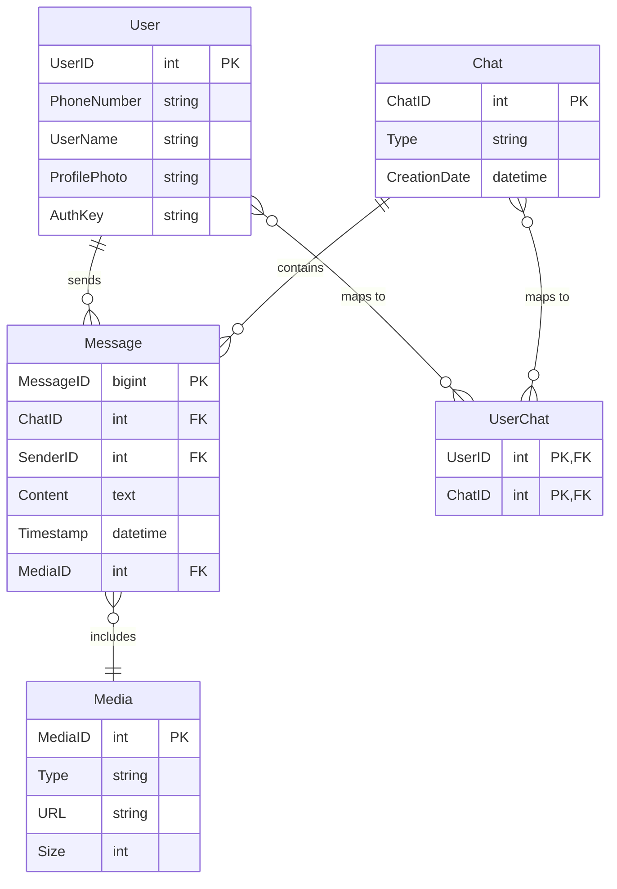
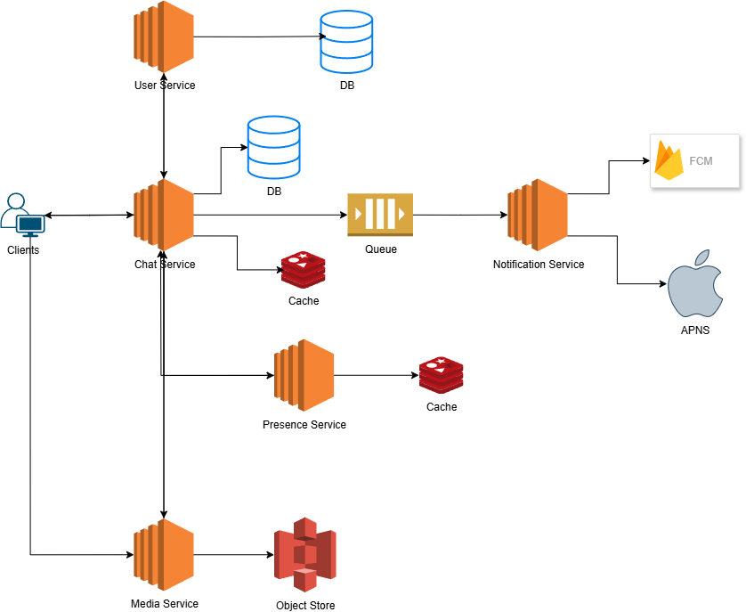
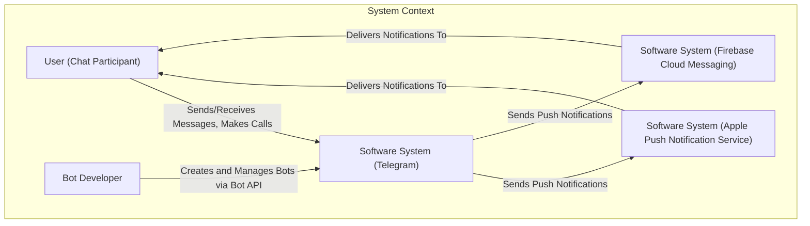
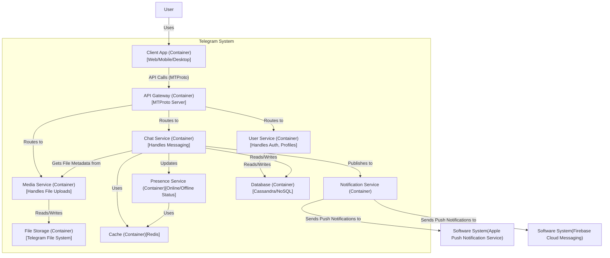
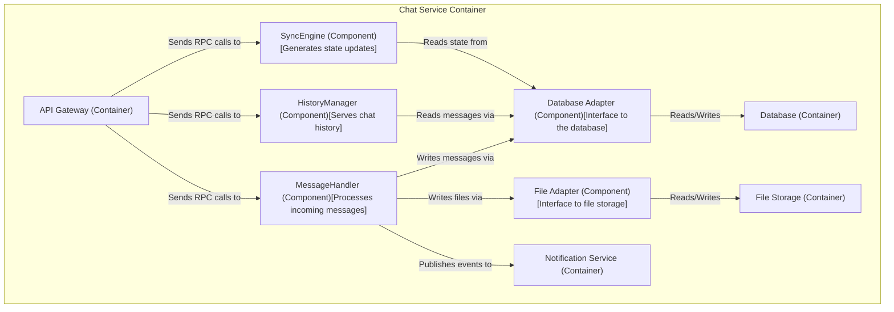

# Telegram System Design

Let's design a real-time, cloud-based instant messaging service like [Telegram](https://telegram.org), known for its focus on speed, security, and multi-device synchronization.

## 1. Purpose: What is Telegram?

Telegram is a globally accessible, freemium, cloud-based messaging application. It provides instant messaging, voice over IP (VoIP), and file-sharing services. With over billion monthly active users, its key features are its seamless multi-device synchronization, large group/channel capacities, and a robust bot platform.

Unlike some competitors, Telegram stores all messages (except for Secret Chats) on its servers, allowing users to access their chat history from any logged-in device simultaneously.

## 2. Scope & Requirements Engineering

Our system should meet the following requirements:

### Functional Requirements (FRs)

-   **1-on-1 Chat:** Support for private messaging between two users.
-   **Group Chats:** Support for large group chats with up to 200,000 members.
-   **Channels:** Support for channels that can broadcast messages to an unlimited number of subscribers.
-   **Cloud Sync:** Messages should be synchronized seamlessly across all of a user's devices (mobile, desktop, web).
-   **File Sharing:** Users should be able to share files up to 2 GB in size.
-   **Secret Chats:** Optional end-to-end encrypted chats that are not stored on Telegram's servers.
-   **Voice and Video Calls:** Support for 1-on-1 secure calls.

### Non-Functional Requirements (NFRs)

-   **High Availability:** The system must be highly available with minimal downtime.
-   **Low Latency:** Message delivery should feel instantaneous to the user.
-   **Scalability:** The architecture must scale to handle billions of active users and billions of messages per day.
-   **Security:** All communication must be encrypted. End-to-end encryption must be available as an option.
-   **Durability:** Once a message is successfully sent, it should never be lost.

### Extended Requirements

-   **Message Status:** Provide sent, delivered, and read receipts.
-   **Presence:** Show the 'last seen' and 'online' status of users.
-   **Push Notifications:** Notify users of new messages when they are not actively using the app.
-   **Bot Platform:** Allow developers to create and integrate third-party bots.

## 3. Estimation and Constraints

Let's perform back-of-the-envelope calculations based on real-world Telegram statistics.

-   **Monthly Active Users (MAU):** 1 billion
-   **Daily Active Users (DAU):** Let's assume 20% of MAU are active daily, so DAU = 200 million.

### Traffic

-   Assume each DAU sends an average of 40 messages per day. This gives us:
    `200 million users * 40 messages/day = 8 billion messages/day`
-   Let's assume a read/write ratio of 5:1 (users read more messages than they send).
-   **Write Requests (new messages):** 8 billion/day
-   **Read Requests (message views):** `8 billion * 5 = 40 billion/day`

### Requests Per Second (RPS)

-   **Write RPS:** `8 billion / (24 * 3600s) = ~92,000 RPS`
-   **Read RPS:** `40 billion / (24 * 3600s) = ~460,000 RPS`

### Storage

-   Assume an average message size of 200 bytes (including metadata).
-   **Message Storage per day:** `8 billion messages * 200 bytes/message = 1.6 TB/day`
-   Assume 5% of messages contain media, with an average file size of 500 KB.
-   **Media Storage per day:** `(8 billion * 5%) * 200 KB = 80 TB/day`
-   **Total Storage per day:** `1.6 TB + 80 TB = ~81.6 TB/day`
-   **Total Storage for 10 years:** `81.6 TB/day * 365 days/year * 10 years = ~297 PB (Petabytes)`

### Bandwidth

**Write Bandwidth:**

Text messages: `92,000 messages/s * 0.2 KB = 18.4 MB/s`

Media messages: `92,000 messages/s * 5% * 500 KB = 2,300 MB/s`

Total write bandwidth:

$$
18.4 \space MB/s + 2,300 \space MB/s = 2,318.4 \space MB/s \approx 2.3 \space GB/s
$$

**Read Bandwidth:**

Text messages: `460,000 messages/s * 0.2 KB = 92 MB/s`

Media messages: `460,000 messages/s * 5% * 500 KB = 11,500 MB/s`

Total read bandwidth:

$$
92 \space MB/s + 11,500 \space MB/s = 11,592 \space MB/s \approx 11.6 \space GB/s
$$

### High-level estimate

| Type | Estimate |
| :--- | :--- |
| Write RPS | ~92,000/s |
| Read RPS | ~460,000/s |
| Storage (10 years) | ~297 PB |
| Bandwidth          | ~13.9 GB/s |

## 4. Data Model Design

We need a highly scalable and distributed database system. Given the scale and the need for flexibility, a NoSQL approach is suitable. We can use a combination of databases tailored for specific needs.

-   **User Data, Chats, Groups:** A distributed Key-Value or Document store like DynamoDB or Cassandra would be ideal. `UserID` would be a good partition key.
-   **Message Data:** A wide-column store like Cassandra is excellent for time-series data like messages. We can partition by `ChatID` and use a timestamp-based clustering key (`MessageID` could be a Snowflake ID) to retrieve messages in chronological order.

Here is the data model which reflects our requirements:





We have the following tables:

-   **User:** `UserID`, `PhoneNumber`, `UserName`, `ProfilePhoto`, `AuthKey`
-   **Chat:** `ChatID`, `Type` (Private, Group, Channel), `CreationDate`, `Participants`
-   **UserChat:** `UserID`, `ChatID` A mapping table to handle the many-to-many relationship between users and chats.
-   **Message:** `MessageID` (unique, time-sortable), `ChatID`, `SenderID`, `Content`, `Timestamp`, `MediaID` (if any)
-   **Media:** `MediaID`, `Type`, `URL` (to object store), `Size`

## 5. API Design

### Internal Client API (MTProto)

This is the core API used by official Telegram clients (iOS, Android, Desktop). It's a complex, RPC-style API built on the MTProto protocol, optimized for speed and synchronization. Below are conceptual examples of the types of functions it provides. read more about [MTProto](https://core.telegram.org/mtproto), [API Methods](https://core.telegram.org/methods).

#### messages.sendMessage

Sends a message to a peer (user, chat, or channel).

```tsx
// Sends a message and returns the state of the update
// so the client knows how to sync.

messages.sendMessage(peer: InputPeer, message: String): Updates
```

#### messages.getHistory

Retrieves the message history for a specific chat.

```tsx
// Retrieves a paginated list of messages for a peer.

messages.getHistory(peer: InputPeer, offset_id: Int, limit: Int): messages.Messages
```

#### updates.getDifference

Fetches incremental updates the client is missing. This is key to Telegram's seamless synchronization.

```tsx
// The client provides its current state (pts, date, qts) and the
// server returns all the updates that have happened since.

updates.getDifference(pts: Int, date: Int, qts: Int): updates.Difference
```

## 6. High-Level Architecture

We will use a microservices architecture to ensure scalability and separation of concerns. Each service will have ownership of its data.

-   **User Service**: An HTTP-based service handling user authentication, profiles, and contacts.
-   **Chat Service**: Manages 1-on-1, group, and channel messaging logic. It uses MTProto for real-time communication.
-   **Presence Service**: Tracks the 'last seen' and 'online' status of users, using a heartbeat mechanism and caching the status in Redis.
-   **Notification Service**: Consumes events from a message queue (like Kafka) to send push notifications via FCM and APNS.
-   **Media Service**: Handles the upload, storage (in TFS - Telegram File System), and retrieval of media files, managing encryption and access control.

### Real-time Messaging

Telegram uses its custom-built protocol, **MTProto**, over a persistent TCP connection for real-time communication. This is a push model where the server sends updates to the client as soon as they are available. This approach is highly efficient and reduces latency compared to pull-based models like long polling, which is only used for the Bot API for simplicity.

### Last Seen

To implement the 'last seen' feature, clients send a periodic heartbeat to the Presence Service. This service updates a timestamp for the `UserID` in a Redis cache. If the last heartbeat was within the last 30-60 seconds, the user is considered 'online'. Otherwise, their status is 'last seen at <timestamp>'.

### Read Receipts

When a user sends a message, it gets a unique `MessageID`. The message is marked as 'sent'. When it reaches the recipient's device, the client sends an acknowledgment (ACK) to the server, and the status is updated to 'delivered'. When the recipient opens the chat and views the message, another ACK is sent, updating the status to 'read'.



### C4 Model Analysis

Here's how we can model the Telegram system using the C4 model.

### Level 1: System Context Diagram

This diagram shows Telegram as a black box, interacting with users and other systems.



### Level 2: Container Diagram

This diagram zooms into the Telegram system, showing its main containers.



### Level 3: Component Diagram (for Chat Service)

This diagram zooms into the **Chat Service** container, showing its internal components.

**To draw in draw.io (Mermaid syntax):**


## 7. Detailed Design

### Data Partitioning

To scale our databases, we will need to partition our data. We can use `UserID` as the primary sharding key for user-related data. For messages, partitioning by `ChatID` is effective. This ensures that all messages for a given chat are co-located, making queries efficient. We can use consistent hashing to ensure even data distribution across shards.

### Caching

We can use a cache like Redis to store hot data. This includes user session information, presence status, and frequently accessed chat messages. For caching, a Least Recently Used (LRU) eviction policy would be suitable. When a cache miss occurs, the service will fetch the data from the database and populate the cache.

### Media Storage and Content Delivery Network (CDN)

For storing media files, we will use a distributed object store like Amazon S3 or Telegram's custom-built Telegram File System (TFS). When a file is uploaded, it is stored and assigned a unique `FileID`. To reduce latency and offload our servers, we will serve media content through a CDN if needed. The CDN will cache files at edge locations closer to the user, ensuring faster downloads.

### API Gateway

An API Gateway will act as the single entry point for all client requests. It will handle the termination of MTProto connections, authentication, rate limiting, and routing requests to the appropriate microservice. Using an API Gateway simplifies the client-side logic and adds a layer of security.

## 8. Identify and Resolve Bottlenecks

Let's identify and resolve potential bottlenecks in our design:

-   **"What if one of our services crashes?"**: We will run multiple instances of each microservice. If one instance fails, the load balancer will redirect traffic to healthy instances.
-   **"How will we distribute our traffic?"**: We will use load balancers at every layer—between clients and the API Gateway, and between services.
-   **"How can we reduce the load on our database?"**: We will use read replicas for our databases to handle the high read traffic. Caching frequently accessed data will also significantly reduce the load.
-   **"Wouldn't the API Gateway be a single point of failure?"**: We will run multiple instances of the API Gateway and use a load balancer to distribute traffic among them. We can also have a standby replica.
-   **"How can we make our notification system more robust?"**: Using a message broker like Apache Kafka ensures that notification requests are not lost if the notification service is temporarily down. It also allows for retries and handles backpressure.
-   **"How can we reduce media storage costs?"**: We can implement media processing to compress files before storing them. We could also implement a policy to delete files that are not accessed for a long period, although this would deviate from Telegram's current 'unlimited storage' offering.


