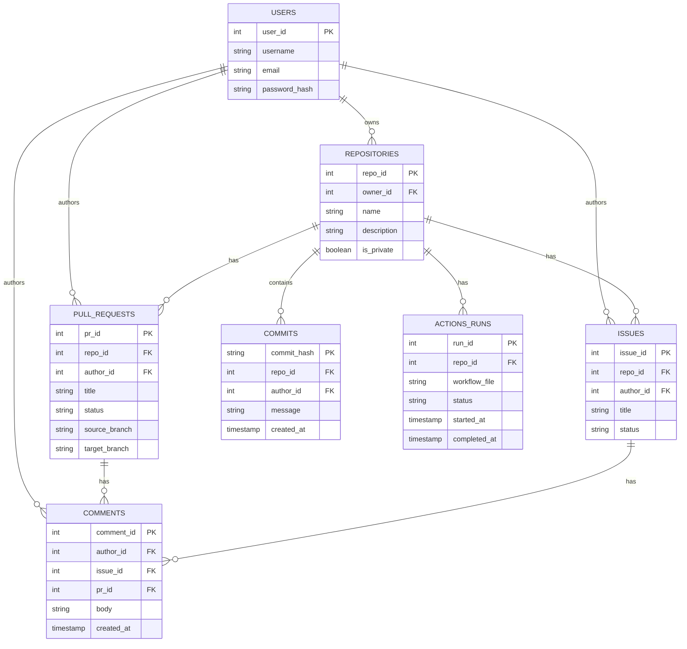
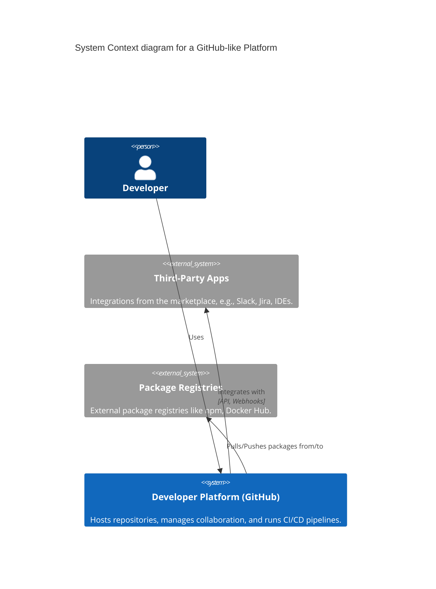
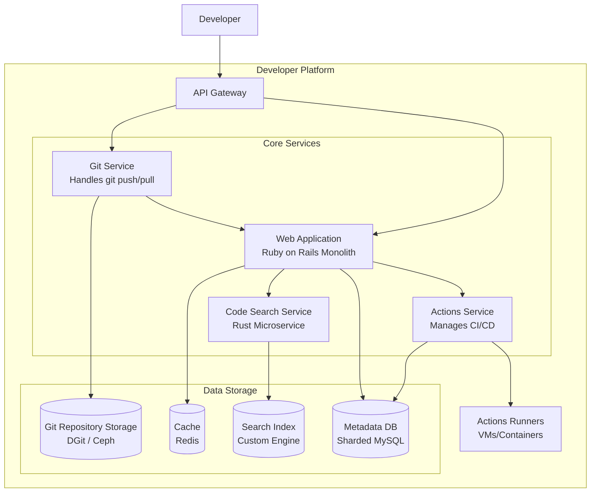
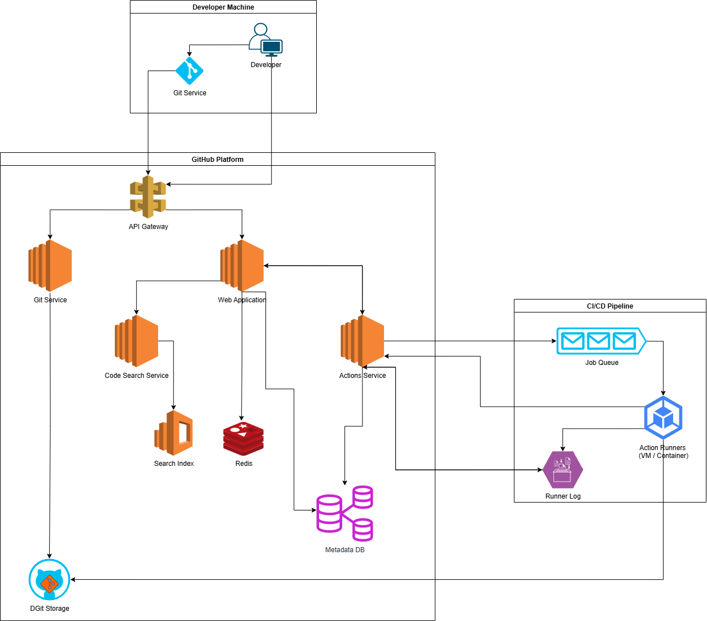

# GitHub System Design: A Deep Dive into a Developer's Platform

## 1. Introduction

GitHub is a web-based platform that provides hosting for software development and version control using Git. It offers the distributed version control and source code management (SCM) functionality of Git, plus its own features. It provides access control and several collaboration features such as bug tracking, feature requests, task management, continuous integration, and wikis for every project.

This document outlines the system architecture for a platform like GitHub, capable of handling millions of users and repositories, providing a reliable, scalable, and performant experience for developers worldwide.

## 2. Requirements

### 2.1. Functional Requirements

-   **Version Control System (VCS)**: Provide a reliable and scalable hosting for Git repositories.
    -   Support for `git push`, `git pull`, `git clone` operations.
-   **Repositories**: Users can create public or private repositories to store their code.
-   **Pull Requests (PRs)**: Users can review and discuss code changes before merging them into the main branch.
    -   Support for inline comments, reviews (approve, request changes), and status checks.
-   **Issues**: Integrated bug tracking and project management system.
-   **CI/CD Pipelines (Actions)**: Allow users to automate their build, test, and deployment workflows directly from their repositories.
-   **User Management**: Secure user authentication, authorization, and profile management.
-   **Organizations and Teams**: Allow users to collaborate in groups with different permission levels.
-   **Social Coding**: Features like forking repositories, starring projects, and following other users.
-   **Code Search**: A powerful and fast search engine to find code across all public repositories.
-   **Project Management**: Kanban-style boards to organize and prioritize work.
-   **Package Registry**: Host and manage software packages (e.g., npm, Docker, Maven).

### 2.2. Non-Functional Requirements

-   **High Availability**: The platform must be highly available with minimal downtime (e.g., 99.99% uptime).
-   **Low Latency**: Git operations (push/pull) and web interactions should be fast and responsive.
-   **Durability**: User's code is the most critical data and must never be lost. Data should be backed up and replicated.
-   **Scalability**: The system must scale to handle millions of users, repositories, and concurrent operations.
-   **Security**: Protect user code and data from unauthorized access. This includes securing the platform itself and providing tools for users to secure their code.
-   **Consistency**: Strong consistency is required for Git operations to ensure the integrity of the repositories. Eventual consistency is acceptable for social features and metadata.

## 3. Capacity Estimations and Constraints

Let's assume the following scale to guide our design:

-   **Total Users**: 100 Million Daily Active Users (DAU)
-   **Traffic Pattern**: Write-Heavy for Git operations, Read-Heavy for web traffic.

### Assumptions and Scale

-   Each user pushes 5 commits per day on average.
-   Each user creates 1 pull request per day.
-   Each user creates 2 issues per day.
-   Each user makes 10 comments per day.
-   Each user makes 50 web requests per day (viewing repos, PRs, issues).
-   Average Git push size: 100 KB
-   Average web request size: 50 KB

### Calculations

**Monthly Requests:**
-   Git pushes (writes): `100M users * 5 pushes/day * 30 days = 15B pushes/month`
-   Pull requests (writes): `100M users * 1 pull request/day * 30 days = 3B pull requests/month`
-   Issues (writes): `100M users * 2 issues/day * 30 days = 6B issues/month`
-   Comments (writes): `100M users * 10 comments/day * 30 days = 30B comments/month`
-   Web requests (reads): `100M users * 50 requests/day * 30 days = 150B requests/month`

**RPS Calculations:**
-   Write RPS = `(15B + 3B + 6B + 30B) / (30 * 24 * 3600) = 21,000 writes/sec`
-   Read RPS = `150B / (30 * 24 * 3600) = 58,000 reads/sec`

**Bandwidth:**
-   Write Bandwidth = `21,000 * 100 KB = 2.1 GB/sec`
-   Read Bandwidth = `58,000 * 50 KB = 2.9 GB/sec`

**Storage (10 years):**
-   Git data + Metadata: `(15B pushes/month + 3B pull requests/month + 6B issues/month + 30B comments/month) * 12 * 10 * 100 KB = 648 PB`
-   **Total Storage**: ~648 PB

**Cache Memory:**
-   Daily read requests: `58,000 * 24 * 3600 = 5B requests/day`
-   Cache 20% of requests with average object size of 50KB
-   Cache Memory: `5B * 0.2 * 50KB = 50 TB/day`

### High-level estimate

| Type | Estimate |
| :---- | :------- |
| Write RPS | 21K |
| Read RPS | 58K |
| Incoming Bandwidth (Write) | 2.1 GB/sec |
| Outgoing Bandwidth (Read) | 2.9 GB/sec |
| Storage (10 years) | 648 PB |
| Cache Memory per Day | 50 TB |

## 4. Data Model Design

The data model needs to support relational metadata (users, PRs, issues) and the graph-based structure of Git data.

### 4.1. ERD Diagram

### 4.2. Database Choices

-   **Metadata Storage**: For relational data like user information, PRs, issues, and comments, a sharded **MySQL** or **PostgreSQL** database is a good choice. It provides strong consistency and transactional guarantees, which are crucial for this type of data.
-   **Git Repository Storage (DGit)**: Storing Git data for millions of repositories in a durable, highly available, and performant way is a massive engineering challenge. GitHub's solution is a custom system called **DGit (Distributed Git)**.
    -   **What is DGit?**: DGit is a distributed storage system designed specifically to store Git repositories. It extends Git's own data model (a content-addressable key-value store) to a distributed environment, eliminating single points of failure.
    -   **Replication and Consistency**: For each repository, DGit maintains multiple replicas (typically 3) on different physical servers. To ensure strong consistency for writes (`git push`), it uses a quorum system. A write is only confirmed after a majority of replicas (e.g., 2 out of 3) acknowledge it. Read operations (`git clone`, `git pull`) can be served by any healthy replica, distributing the load.
    -   **Automatic Failover and Healing**: DGit continuously monitors the health of all replicas. If a primary server for a repository fails, another replica is automatically promoted. The system then "heals" by creating a new replica on a different healthy server to restore the desired replication factor.
    -   **Git-Native Design**: While a general-purpose distributed filesystem like Ceph could be used, DGit is tailored to Git's specific access patterns (many small, random reads of objects). It understands Git objects and refs, allowing it to perform Git-specific optimizations (like distributed garbage collection) that a generic filesystem cannot.

## 5. API Design

### 5.1. Client-facing API (REST)

-   **Repositories**
    -   `POST /user/repos`
    -   `GET /repos/{owner}/{repo}`
-   **Pull Requests**
    -   `GET /repos/{owner}/{repo}/pulls`
    -   `POST /repos/{owner}/{repo}/pulls`
    -   `GET /repos/{owner}/{repo}/pulls/{pull_number}`
-   **Issues**
    -   `GET /repos/{owner}/{repo}/issues`
    -   `POST /repos/{owner}/{repo}/issues`
-   **Actions**
    -   `GET /repos/{owner}/{repo}/actions/runs`

### 5.2. Internal APIs (gRPC)

-   **Git Service**: `rpc HandlePush(PushRequest) returns (PushResponse)`
-   **Actions Service**: `rpc TriggerWorkflow(WorkflowRequest) returns (WorkflowRun)`
-   **Merge Service**: `rpc MergePullRequest(MergeRequest) returns (MergeResponse)`

## 6. High-Level Architecture

GitHub's architecture is a hybrid model, combining a large Ruby on Rails monolith for most web-facing features with a set of specialized microservices for performance-critical and resource-intensive tasks like Git operations, code search, and CI/CD.

### 6.1. C4 Context Diagram

### 6.2. C4 Container Diagram

## 7. Detailed Design

### 7.1. Git Storage Layer (DGit)

Storing trillions of Git objects and serving them with low latency and high availability is a major challenge. GitHub developed a custom solution called DGit (Distributed Git) to address this.

-   **Replication**: Each repository is replicated on 3 different servers. This ensures that if one server fails, the data is still available from the other two replicas.
-   **Consistency**: DGit uses a quorum-based approach for writes. A write is considered successful only when at least 2 out of 3 replicas have confirmed the write. This provides strong consistency for Git operations.
-   **Load Balancing**: Read requests (like `git clone` or `git pull`) can be served by any of the 3 replicas, which helps to distribute the load.
-   **Automatic Failover**: If a primary server for a repository goes down, one of the replicas is automatically promoted to be the new primary.

### 7.2. CI/CD Pipeline (Actions)

GitHub Actions allows users to automate workflows in response to events (e.g., code pushes, PR creation).

1.  **Event Trigger**: An event occurs in a repository (e.g., a `push` to the main branch).
2.  **Workflow Definition**: The Actions Service reads the corresponding workflow file (e.g., `.github/workflows/main.yml`) from the repository.
3.  **Job Orchestration**: The service parses the workflow file and schedules the jobs on available runners.
4.  **Runner Execution**: A runner (a VM or container) is provisioned for the job. It clones the repository, installs dependencies, and executes the steps defined in the workflow.
5.  **Logging and Artifacts**: The runner streams logs back to the Actions Service, which are displayed to the user in real-time. Any artifacts produced by the job (e.g., binaries, test reports) are uploaded to a blob store like S3.
6.  **Status Update**: The Actions Service updates the status of the workflow run (e.g., success, failure) and reports it back to the user via the web UI and status checks on PRs.

### 7.3. Code Search Engine

GitHub's code search is a custom-built engine written in Rust, designed for high performance and scalability.

-   **Indexing**: A fleet of indexer processes continuously scan repositories for changes. When a push occurs, the affected repository is re-indexed.
-   **Search Index**: The index is partitioned by repository and stored in a distributed search engine. This allows for horizontal scaling of the search index.
-   **Query Engine**: The search query is parsed and distributed to the relevant index partitions. The results are then aggregated, ranked, and returned to the user.
-   **Ranking**: Search results are ranked based on factors like file path, code content, and repository popularity.

## 8. Scalability and Resilience

### 8.1. Scalability

-   **Horizontal Scaling**: The web application (Rails monolith) and all microservices are stateless and can be scaled horizontally by adding more instances behind a load balancer.
-   **Database Sharding**: The metadata database (MySQL) is sharded by `user_id` or `repository_id` to distribute the load. This allows the database to scale horizontally as the number of users and repositories grows.
-   **Distributed File System**: The Git repository storage (DGit) is designed for horizontal scalability. New nodes can be added to the cluster to increase storage capacity and throughput.
-   **Asynchronous Workflows**: CI/CD jobs, webhooks, and other long-running tasks are handled asynchronously by background workers, which can be scaled independently.

### 8.2. Resilience

-   **Replication**: All data stores (metadata DB, Git storage, cache) are replicated across multiple data centers to prevent data loss and ensure high availability.
-   **Circuit Breakers**: To prevent cascading failures, circuit breakers are used. For example, if the search service is down, the web application can disable the search feature temporarily instead of failing requests.
-   **Graceful Degradation**: If a non-critical service fails, the platform should degrade gracefully. For example, if the Actions service is down, users can still browse code and manage issues.
-   **Rate Limiting**: The API Gateway enforces rate limiting to protect the platform from abusive clients and denial-of-service attacks.

## 9. Bottlenecks and Resolutions

-   **Hot Repositories**: A very popular repository can become a bottleneck, as many users will be cloning, forking, and creating pull requests for it.
    -   **Resolution**: Implement aggressive caching for popular repositories. Use read replicas for the metadata database to handle the high read load.
-   **Large Monorepos**: A single, very large repository can be slow to clone and can put a high load on the Git storage layer.
    -   **Resolution**: Encourage the use of partial clones and shallow clones to reduce the amount of data transferred. Optimize the Git server performance for large repositories.
-   **CI/CD Runner Capacity**: During peak times, there might not be enough runners available to execute all the CI/CD jobs, leading to long queue times.
    -   **Resolution**: Use an auto-scaling group of runners. When the queue of pending jobs grows, new runner VMs or containers are automatically provisioned.

