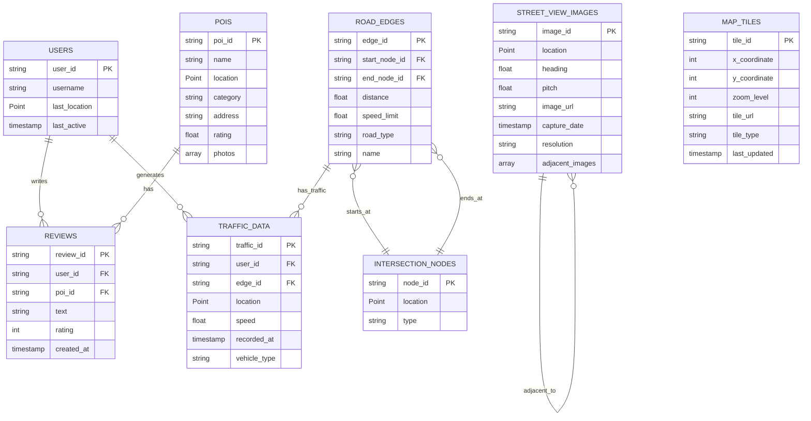
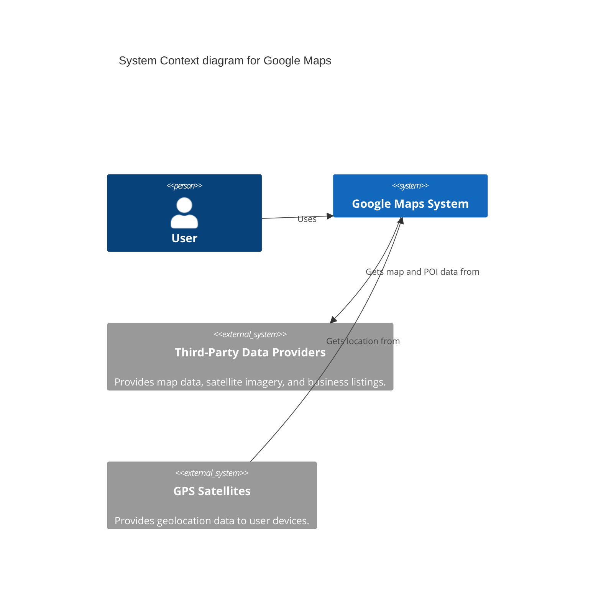
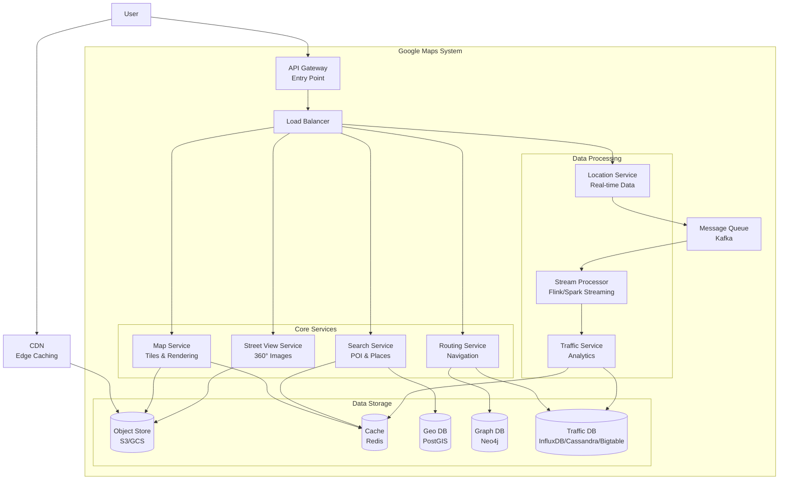
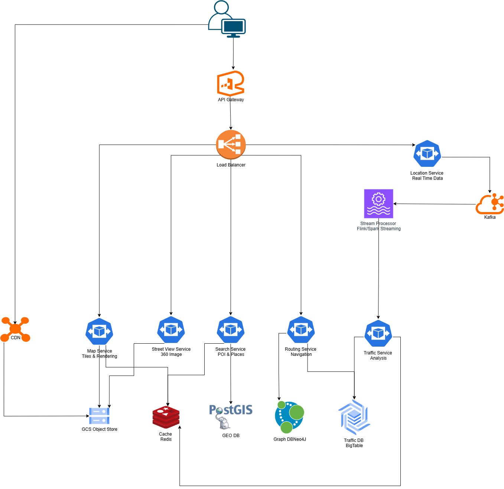

# Google Maps System Design

This document outlines the system design for a service similar to Google Maps. We will cover the core requirements, architecture, data model, and scalability strategies needed to build a robust and highly available mapping service.

## 1. The Purpose and Core Problem

Google Maps is a web mapping platform and consumer application that offers satellite imagery, aerial photography, street maps, 360° interactive panoramic views of streets (Street View), real-time traffic conditions, and route planning for traveling by foot, car, and public transportation.

The core problem is to design a system that can:
-   Store and serve massive amounts of geographical data efficiently.
-   Provide accurate, real-time location tracking and route calculation.
-   Handle millions of concurrent users with low latency.
-   Offer a rich, interactive user experience with various map layers and points of interest.

## 2. Requirements

### 2.1. Functional Requirements

-   **Map Display**: Display interactive maps with multiple zoom levels and views (e.g., satellite, terrain, street view).
-   **Location Search**: Allow users to search for locations, landmarks, and addresses.
-   **Route Planning**: Provide optimal routes between two points based on distance, time, and mode of transport (car, bike, walk, public transit).
-   **Real-Time Traffic**: Display live traffic conditions and suggest alternative routes based on traffic jams.
-   **ETA Calculation**: Provide an accurate Estimated Time of Arrival (ETA) for the calculated route.
-   **Points of Interest (POI)**: Show nearby points of interest like restaurants, hospitals, and gas stations, with details like ratings and opening hours.
-   **User Location**: Pinpoint the user's current location on the map.
-   **Street View**: Provide 360° interactive panoramic views of streets, allowing users to virtually navigate and explore locations at street level.

### 2.2. Non-Functional Requirements

-   **High Availability**: The system must be highly available with minimal downtime.
-   **Low Latency**: Map rendering, search, and route calculations should be performed with very low latency (within a few seconds).
-   **Scalability**: The system must scale to handle a massive number of concurrent users and a growing dataset.
-   **Accuracy**: Location data, routing, and ETA must be highly accurate and up-to-date.
-   **Consistency**: Data should be eventually consistent across the distributed system. Real-time data like traffic requires stronger consistency.
-   **Security**: User location data and personal information must be secure.

## 3. Capacity Estimations and Constraints

Let's assume the following scale to guide our design:

-   **Total Users**: 1 Billion Daily Active Users (DAU)
-   **Traffic Pattern**: Read-Heavy system (Read/Write Ratio = 100:1)
-   **User Behavior**:
    -   Each user makes 10 map tile requests per day
    -   Each user makes 1 search request per day
    -   Each user makes 0.1 route requests per day
    -   10% of users access Street View (1 request per day)
    -   Location pings (real-time): 1 per minute for active users (assume 10% are actively sharing location)

### Calculations

**Monthly Requests:**
-   Map tile requests: `1B users * 10 requests/day * 30 days = 300B requests/month`
-   Search requests: `1B users * 1 request/day * 30 days = 30B requests/month`
-   Route requests: `1B users * 0.1 requests/day * 30 days = 3B requests/month`
-   Street View requests: `100M users * 1 request/day * 30 days = 3B requests/month`
-   Location pings (writes): `100M users * 1440 pings/day * 30 days = 4.32T pings/month`

**Total Monthly Reads**: `336B requests/month`
**Total Monthly Writes**: `4.32T requests/month`

**RPS Calculations:**
-   Write RPS = `4.32T / (30 * 24 * 3600) = 1.7m writes/sec`

- Map tile RPS = `300B / (30 * 24 * 3600) = 116k map tile requests/sec`
- Search RPS = `30B / (30 * 24 * 3600) = 11k search requests/sec`
- Route RPS = `3B / (30 * 24 * 3600) = 1k route requests/sec`
- Street View RPS = `3B / (30 * 24 * 3600) = 1k street view requests/sec`
- Location ping RPS = `4.32T / (30 * 24 * 3600) = 1k location ping requests/sec`
-   Read RPS = `336B / (30 * 24 * 3600) = 130k reads/sec`

**Bandwidth:**
-   Average map tile size: 25KB
-   Average search response: 2KB
-   Average route response: 5KB
-   Average Street View image: 5MB
-   Average location ping: 100 bytes

-   Write Bandwidth = `1.7m * 100 bytes = 170 MB/sec`
-   Read Bandwidth = `(Map tiles: 25KB * 116k RPS) + (Search: 2KB * 11k RPS) + (Routes: 5KB * 1k RPS) + (Street View: 5MB * 1k RPS) + (Location ping: 100 bytes * 1k RPS) = 2.9 GB/sec + 22 MB/sec + 5 MB/sec + 5 GB/sec + 100 MB/sec = 8 GB/sec`

**Storage (10 years):**
-   Location pings: `4.32T * 12 * 10 * 100 bytes = 51.8 PB`
-   Map data (static): 10 PB (the entire world's map data is estimated to be several Petabytes (PB))
-   Street View imagery: 5 PB (360° panoramic views images captured at regular intervals along roads. Assuming coverage of 10 million km of the world's roads, with images every 10m)
-   POI data: 200 GB
-   **Total Storage**: ~67 PB

**Cache Memory:**
-   Daily read requests: `130k * 24 * 3600 = 11.2B requests/day`
-   Cache 20% of requests with average object size of 100KB
-   Cache Memory: `11.2B * 0.2 * 100KB = 224 TB/day`

### High-level estimate

Here is our high-level estimate:

| Type | Estimate |
| :---- | :------- |
| Write RPS | 1.67M |
| Read RPS | 130K |
| Incoming Bandwidth (Write) | 167 MB/sec |
| Outgoing Bandwidth (Read) | 8 GB/sec |
| Storage (10 years) | 67 PB |
| Cache Memory per Day | 224 TB |

These estimations highlight the need for a massively scalable and distributed architecture, with a strong emphasis on data partitioning, caching, and efficient data processing.

## 4. Data Model Design

The data model must handle complex geospatial data, points of interest, and user information. A combination of databases is suitable for this purpose.

### 4.1. Geospatial Data and Tiling

The world map is too large to be rendered at once. It's broken down into smaller, manageable square images called **tiles**. These tiles are pre-rendered at various zoom levels.

-   **Quadtrees**: To efficiently query tiles for a given viewport (latitude, longitude, zoom level), we can use a Quadtree. The world map is the root of the tree. At each level of zoom, the map is divided into four quadrants, each becoming a child node. This hierarchical structure allows for quick traversal to find the relevant tiles for a user's screen.
-   **Geohashing**: Geohashing is another technique to encode a geographic location into a short string of letters and digits. It's a hierarchical spatial data structure which subdivides space into buckets of grid shape. Nearby places will have similar prefixes in their geohash, which is useful for proximity searches.

### 4.2. Database Schema

Here is an Entity-Relationship Diagram representing the core entities:

We will use a polyglot persistence approach, leveraging different databases for different needs.

-   **Geospatial Data (Roads, Boundaries)**: A distributed graph database like **Neo4j** or a custom solution built on a NoSQL store like **Google Bigtable** or **Cassandra** is ideal. The road network is naturally a graph where intersections are nodes and roads are edges with weights (distance, speed limit, real-time traffic).

    -   `Nodes (Intersections)`: `node_id`, `location (lat, lon)`
    -   `Edges (Roads)`: `edge_id`, `start_node`, `end_node`, `distance`, `speed_limit`, `type (highway, local)`

-   **Map Tiles and Satellite Imagery**: Stored in a distributed object store like **Google Cloud Storage** or **Amazon S3**. Tiles can be indexed by their quadtree path or geohash.

-   **Street View Imagery**: 360° panoramic images stored in object storage with metadata in a separate database.

    -   `StreetViewImages` collection/table:
        -   `image_id`: UUID
        -   `location`: GeoJSON Point (lat, lon)
        -   `heading`: Float (0-360 degrees, camera direction)
        -   `pitch`: Float (vertical angle)
        -   `image_url`: String (URL to panoramic image in object storage)
        -   `capture_date`: Timestamp
        -   `resolution`: String (e.g., '4096x2048')
        -   `adjacent_images`: Array of image_ids for navigation

-   **Points of Interest (POI)**: A NoSQL document database like **MongoDB** or a relational database like **PostgreSQL** with PostGIS extension for geospatial queries.

    -   `POIs` collection/table:
        -   `poi_id`: UUID
        -   `name`: String
        -   `location`: GeoJSON Point
        -   `category`: String (e.g., 'restaurant', 'hospital')
        -   `address`: String
        -   `rating`: Float
        -   `reviews`: Array of review objects
        -   `photos`: Array of photo URLs

-   **Real-time Traffic Data**: A time-series database like **InfluxDB** or a wide-column store like **Cassandra** is suitable for handling the high-velocity stream of location data from users.

## 5. API Design

A microservices architecture implies that each service will expose its own set of APIs. We can use a combination of REST/HTTP for client-server communication and gRPC for internal service-to-service communication.

### 5.1. Client-facing API (via API Gateway)

-   `GET /v1/tiles?x={x}&y={y}&zoom={zoom}`: Retrieves a map tile for a given coordinate and zoom level.
-   `GET /v1/search?query={text}&location={lat,lon}`: Searches for a place.
    -   `query`: 'restaurants near me', 'Eiffel Tower'
    -   `location`: User's current location to bias results.
-   `GET /v1/directions?origin={lat,lon}&destination={lat,lon}&mode={mode}`: Calculates the route between two points.
    -   `mode`: 'driving', 'walking', 'transit'
-   `GET /v1/poi/{poi_id}`: Retrieves details for a specific Point of Interest.
-   `GET /v1/streetview?location={lat,lon}&heading={degrees}&pitch={degrees}&fov={degrees}`: Retrieves Street View panoramic image for a location.
    -   `heading`: Camera direction (0-360 degrees)
    -   `pitch`: Vertical angle (-90 to 90 degrees)
    -   `fov`: Field of view (10-120 degrees)

### 5.2. Internal APIs (gRPC)

-   **Routing Service**:
    -   `rpc GetRoute(RouteRequest) returns (RouteResponse)`
-   **Search Service**:
    -   `rpc SearchPlaces(SearchRequest) returns (SearchResponse)`
-   **Geolocation Service**:
    -   `rpc GetUserLocation(UserLocationRequest) returns (UserLocationResponse)`
-   **Street View Service**:
    -   `rpc GetStreetViewImage(StreetViewRequest) returns (StreetViewResponse)`
    -   `rpc GetNearbyStreetViewImages(LocationRequest) returns (StreetViewImagesResponse)`

## 6. High-Level Architecture

We will adopt a microservices architecture to ensure scalability, resilience, and maintainability. An API Gateway will serve as the single entry point for all client requests, routing them to the appropriate backend service.

### 6.1. Core Services

-   **API Gateway**: Handles client authentication, rate limiting, and request routing to internal services.
-   **Web/Mobile Client**: The user-facing application that renders maps and interacts with the user.
-   **Map Service**: Responsible for rendering and serving map tiles. It queries the tile store and returns the appropriate tiles for the user's viewport.
-   **Routing Service**: Calculates the optimal route between two points. It uses the road network graph and real-time traffic data.
-   **Search Service**: Handles location and POI search queries. It uses a search index for fast lookups.
-   **Geolocation Service**: Manages real-time user location data. It receives location pings from clients and provides this data to other services like the Traffic Service.
-   **Traffic Service**: Ingests and processes real-time location data to generate traffic models and heatmaps. This information is fed back into the Routing Service.

### 6.2. Data Flow

**Map Rendering Flow**:
1.  The client requests map tiles for its current viewport from the API Gateway.
2.  The Gateway forwards the request to the Map Service.
3.  The Map Service calculates the required tile IDs (e.g., using a quadtree) for the given coordinates and zoom level.
4.  It first checks a cache (like Redis) for these tiles.
5.  If not in the cache, it fetches the tiles from the Object Storage (S3/GCS) and caches them.
6.  The tiles are returned to the client.

**Route Calculation Flow**:
1.  The client sends an origin and destination to the API Gateway.
2.  The request is routed to the Routing Service.
3.  The Routing Service queries the road network graph database.
4.  It also requests real-time traffic data from the Traffic Service.
5.  Using an algorithm like A* (A-star), it computes the optimal path, considering both distance and current traffic.
6.  The resulting route is returned to the client.

## 7. Detailed Design

### 7.1. Map Tiling and Rendering

To handle the massive scale of the world map, we pre-process and store it as image tiles at different zoom levels. This is a classic pyramid scheme.

-   **Zoom Levels**: We can define around 20 zoom levels. Level 0 might be a single tile representing the entire world, while Level 20 provides street-level detail.
-   **Tile Generation**: A massive offline job runs to render these tiles from raw vector and satellite data. This is a highly parallelizable task.
-   **Caching**: A multi-layered caching strategy is crucial.
    -   **Client-Side Cache**: The browser/mobile app caches recently viewed tiles.
    -   **CDN**: A Content Delivery Network (CDN) caches popular tiles at edge locations, closer to users.
    -   **In-Memory Cache**: A distributed cache like Redis or Memcached stores hot tiles for the Map Service.

### 7.2. Routing Engine

The core of the routing engine is a weighted graph of the world's roads. 

-   **Graph Partitioning**: The entire world graph is too large to fit in a single server's memory. We can partition the graph by geographic region (e.g., using S2 geometry library from Google). A route calculation between two distant points would involve multiple partitions.
-   **Pathfinding Algorithm**: Dijkstra's algorithm can find the shortest path, but it's slow as it explores in all directions. **A*** is a better choice as it uses a heuristic (like the straight-line distance to the destination) to guide its search, making it much faster.
-   **Real-Time Traffic Integration**: The weight of the graph edges (roads) is not static. It's a dynamic value calculated as `distance / (average_speed)`. The `average_speed` is constantly updated by the Traffic Service based on real-time data. When a route is requested, the Routing Service uses the most current edge weights.

### 7.3. Real-Time Data Processing Pipeline

This pipeline is responsible for turning raw location pings into actionable traffic insights.

1.  **Ingestion**: The Geolocation Service receives a high volume of location updates from clients. These updates are published to a message queue like **Apache Kafka** for durable and scalable ingestion.
2.  **Stream Processing**: A stream processing engine like **Apache Flink** or **Apache Spark Streaming** consumes the data from Kafka.
3.  **Aggregation**: The stream processor aggregates the data. For each road segment, it calculates the average speed and density of vehicles over a sliding time window (e.g., the last 5 minutes).
4.  **Storage**: The processed traffic data (e.g., `road_segment_id`, `timestamp`, `average_speed`) is stored in a time-series database or a wide-column store for historical analysis and is also pushed to a fast key-value store (like Redis) for the Routing Service to access with low latency.

## 8. Scalability and Resilience

### 8.1. Scalability

-   **Horizontal Scaling**: All services are stateless and can be scaled horizontally by adding more instances behind a load balancer.
-   **Database Sharding**: 
    -   The **Road Network Graph** can be sharded by geographic region. Queries that span multiple regions will require a coordinator to query multiple shards and stitch the results together.
    -   The **POI database** can be sharded by `poi_id` or by geographic location.
    -   The **Traffic Data** store (Cassandra/Bigtable) has built-in scalability and partitioning features.
-   **CDN for Map Tiles**: Using a CDN is a critical scalability strategy. It offloads the vast majority of tile requests from our origin servers, reducing latency and cost.

### 8.2. Resilience

-   **Replication**: All databases and data stores should be replicated across multiple availability zones to prevent data loss in case of a failure.
-   **Circuit Breakers**: To prevent a failing service from causing cascading failures, we can implement circuit breakers (e.g., using a library like Hystrix). If a service like the Routing Service is down, the client can be served a cached or default route.
-   **Graceful Degradation**: If the real-time Traffic Service is unavailable, the Routing Service should gracefully degrade to providing routes based on historical traffic data or just distance.
-   **Asynchronous Communication**: Using a message queue (Kafka) for the data pipeline decouples the Geolocation service from the stream processors, making the ingestion pipeline resilient to downstream failures.

## 9. Bottlenecks and Resolutions

-   **Routing Service Hotspots**: If many users in a dense area (like a major city) request routes simultaneously, the graph partition for that region could become a bottleneck. 
    -   **Resolution**: Further shard the graph for that region and add more compute resources. Aggressively cache common routes.
-   **Real-Time Data Ingestion**: The sheer volume of location pings can overwhelm the ingestion endpoint.
    -   **Resolution**: Scale the Kafka cluster and the Geolocation service instances. The client can also batch location updates to reduce the number of requests.
-   **Database Read/Write Load**: The POI database might experience high read load for popular places.
    -   **Resolution**: Implement a read-through caching layer (like Redis) in front of the database to serve popular POI data from memory.

## 10. Conclusion

This document outlines a scalable and resilient system design for a Google Maps-like service. By leveraging a microservices architecture, polyglot persistence, and a robust data processing pipeline, the system can handle massive scale and provide a low-latency, feature-rich experience to users. The key design principles are data partitioning, aggressive caching at multiple levels, and asynchronous communication for resilience. The use of specialized technologies like graph databases for routing and stream processing for real-time traffic is crucial for meeting the functional and non-functional requirements.