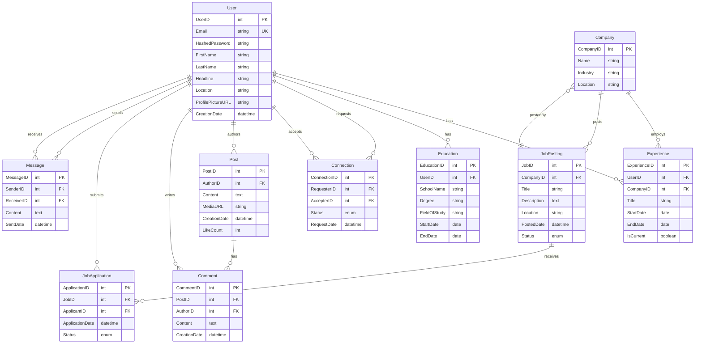
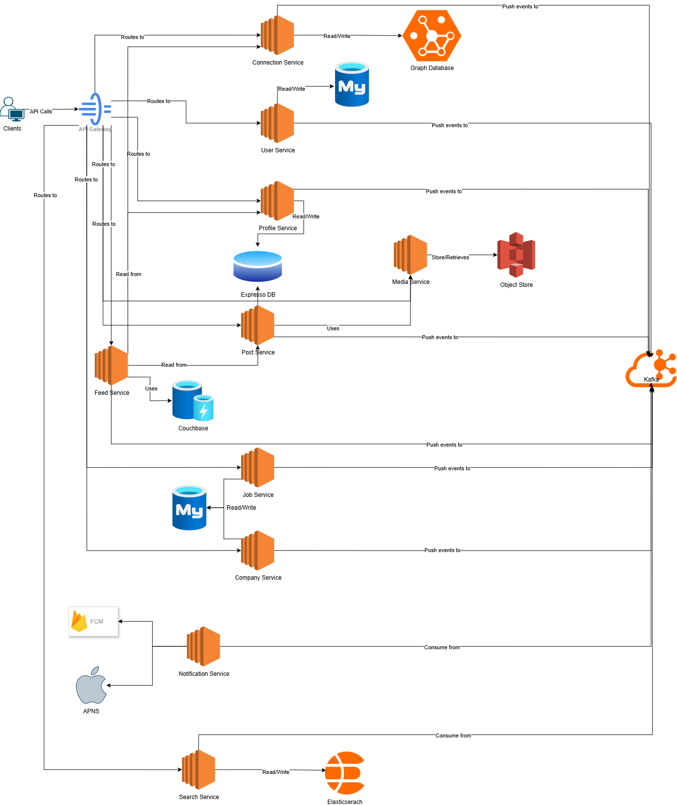
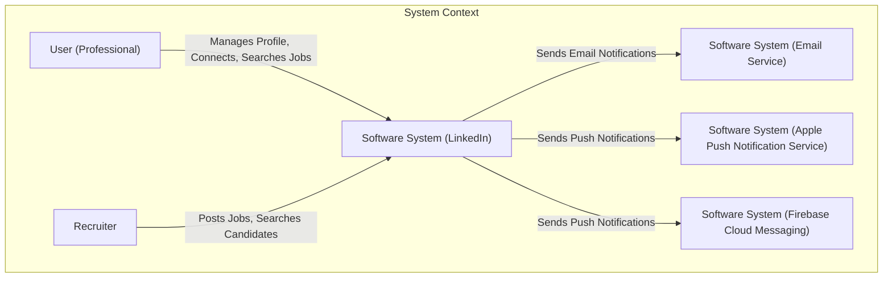
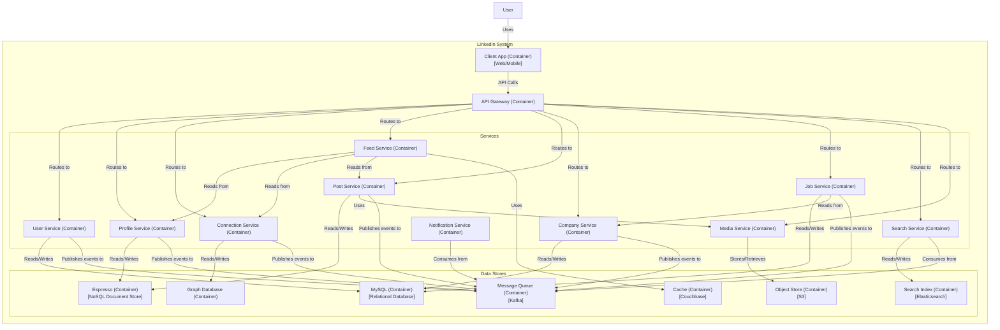
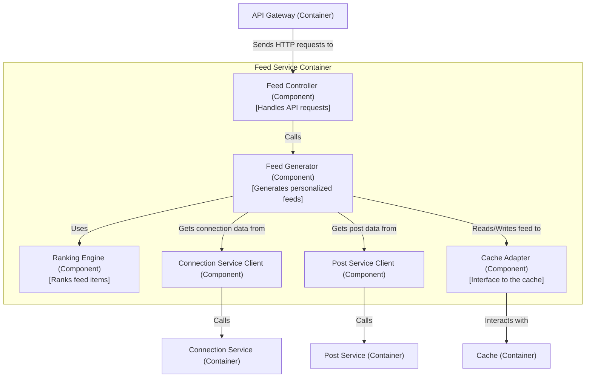
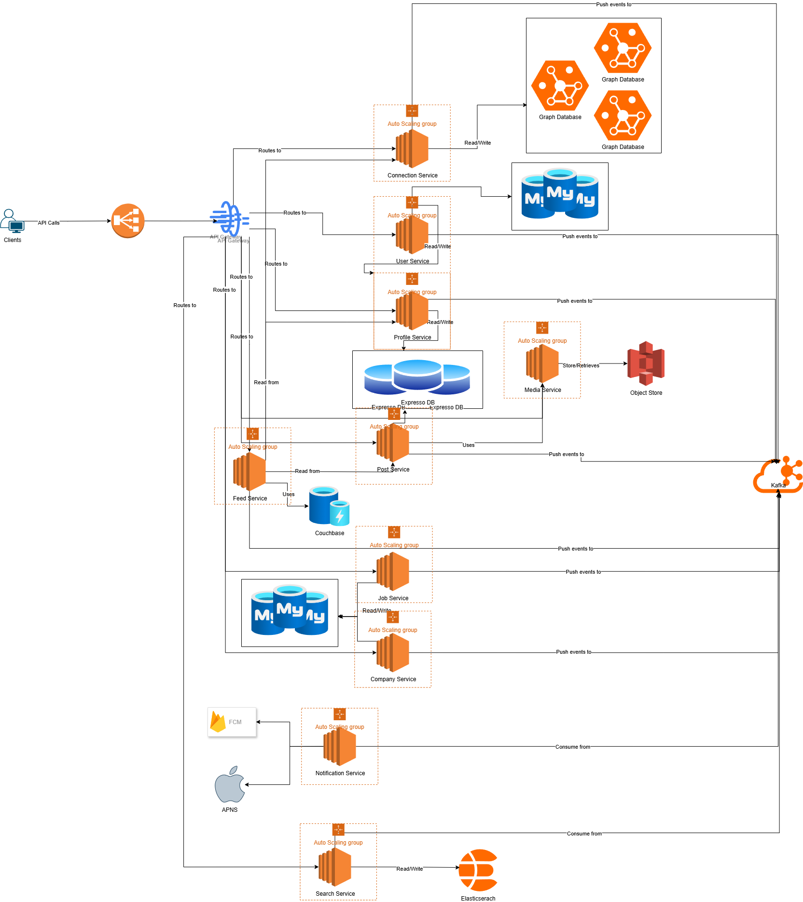

# LinkedIn System Design

Let's design a professional networking service like [LinkedIn](https://www.linkedin.com), the world's largest professional network on the internet.

## 1. Purpose: What is LinkedIn?

LinkedIn is a social networking service that operates via websites and mobile apps. It is mainly used for professional networking, including employers posting jobs and job seekers posting their CVs. It allows members (both workers and employers) to create profiles and "connections" to each other in an online social network which may represent real-world professional relationships.

## 2. Scope & Requirements Engineering

Our system should meet the following requirements:

### Functional Requirements (FRs)

-   **User Profiles:** Users can create and manage detailed professional profiles including work experience, education, skills, and accomplishments.
-   **Connections:** Users can connect with other professionals, forming a network.
-   **News Feed:** Users see a feed of updates from their connections and followed companies.
-   **Content Sharing:** Users can post articles, status updates, photos, and videos.
-   **Job Postings:** Companies can post job openings, and users can apply for them.
-   **Search:** Users can search for people, jobs, companies, and groups.
-   **Messaging (InMail):** Users can send private messages to their connections.

### Non-Functional Requirements (NFRs)

-   **High Availability:** The system must be highly available with minimal downtime.
-   **Low Latency:** The news feed, profile pages, and search results should load quickly.
-   **Scalability:** The architecture must scale to handle over a billion users and their activities.
-   **Consistency:** Data consistency is crucial. A user's profile changes should be reflected across the platform. Eventual consistency is acceptable for some features like the news feed.
-   **Durability:** User data, once saved, should never be lost.

### Extended Requirements

-   **Notifications:** Notify users about connection requests, messages, and relevant job postings.
-   **Endorsements & Recommendations:** Users can endorse skills and write recommendations for their connections.
-   **Groups:** Support for professional groups where users can discuss specific topics.

## 3. Estimation and Constraints

Let's perform back-of-the-envelope calculations based on real-world LinkedIn statistics.

-   **Monthly Active Users (MAU):** 1.15 billion
-   **Daily Active Users (DAU):** Let's assume ~17% of MAU are active daily, so DAU = ~200 million.

### Traffic

-   Assume each DAU views their feed, checks 5 profiles, and performs 1 search per day.
-   Assume a read/write ratio of 10:1 (users consume more content than they create).
-   **Feed Views:** 200 million/day
-   **Profile Views:** 200 million * 5 = 1 billion/day
-   **Searches:** 200 million/day
-   **Total Read Requests:** ~1.6 billion/day
-   **Write Requests (new posts, connections, etc.):** 1.6 billion / 10 = 160 million/day

### Requests Per Second (RPS)

-   **Read RPS:** `1.6 billion / (24 * 3600s) = ~18,000 RPS`
-   **Write RPS:** `160 million / (24 * 3600s) = ~1,800 RPS`

### Storage

-   **User Profile Data:** Assume each profile is 1 MB on average (including text, skills, endorsements).
    `1.15 billion users * 1 MB/user = 1.15 PB`
-   **Posts/Articles:** Assume 10% of DAU post once a day, with an average post size of 1 KB.
    `(200 million * 10%) * 1 KB = ~20 GB/day`
-   **Media Storage (Images/Videos):** Assume 1% of posts contain media, with an average size of 2 MB.
    `(20 million posts * 1%) * 2 MB = ~40 GB/day`
-   **Total Storage per day (new content):** ~60 GB/day
-   **Total Storage for 10 years (content only):** `60 GB/day * 365 days/year * 10 years = ~22 PB`
-   **Total Storage (Profiles + Content):** `1.15 PB + 22 PB = ~23 PB`

### Bandwidth

**Write Bandwidth:**

Based on 1,800 total write RPS distributed as:
- Posts (assume 80% of writes): `1,800 * 0.8 = 1,440 RPS`
- Profile updates (assume 20% of writes): `1,800 * 0.2 = 360 RPS`

Text posts: `1,440 posts/s * 1 KB = 1.44 MB/s`
Media posts: `1,440 posts/s * 1% * 2 MB = 28.8 MB/s`
Profile updates: `360 updates/s * 1 MB = 360 MB/s`

Total write bandwidth:

$$
1.44 \space MB/s + 28.8 \space MB/s + 360 \space MB/s = 390.24 \space MB/s \approx 0.39 \space GB/s
$$

**Read Bandwidth:**

Based on 18,000 total read RPS distributed as:
- Feed views: `200M/day ÷ (24×3600) = 2,315 RPS`
- Profile views: `1B/day ÷ (24×3600) = 11,574 RPS`  
- Searches: `200M/day ÷ (24×3600) = 2,315 RPS`
- Other requests: `18,000 - 16,204 = 1,796 RPS`

Feed views: `2,315 requests/s * 10 KB = 23.15 MB/s`
Profile views: `11,574 requests/s * 1 MB = 11,574 MB/s`
Search results: `2,315 requests/s * 5 KB = 11.58 MB/s`
Other requests: `1,796 requests/s * 2 KB = 3.59 MB/s`

Total read bandwidth:

$$
23.15 \space MB/s + 11,574 \space MB/s + 11.58 \space MB/s + 3.59 \space MB/s = 11,612.32 \space MB/s \approx 11.61 \space GB/s
$$

### High-level estimate

| Type               | Estimate      |
| :----------------- | :------------ |
| Read RPS           | ~18,000/s     |
| Write RPS          | ~1,800/s      |
| Storage (10 years) | ~23 PB        |
| Bandwidth          | ~12 GB/s       |

## 4. Data Model Design

Given the diverse nature of data on LinkedIn (user profiles, connections, posts, jobs), a polyglot persistence approach is suitable. We'll use a combination of databases based on their strengths:

-   **NoSQL Document Store (Espresso):** LinkedIn's primary online data store. It's perfect for storing semi-structured data like user profiles, posts, and messages. Its distributed nature provides the scalability and availability we need.
-   **Relational Database (MySQL):** Ideal for structured data that requires transactional integrity, such as job postings, company information, and billing data.
-   **Graph Database (Custom-built):** LinkedIn has its own graph database to manage the massive network of connections. This allows for efficient traversal of the social graph to find connections, recommend contacts, and calculate degrees of separation.

Here is a streamlined ERD representing the core entities with essential relationships:



## 5. API Design

We will design a RESTful API for client-server communication.

### User Management APIs

```http
# User Registration & Authentication
POST /api/v1/auth/register
POST /api/v1/auth/login
POST /api/v1/auth/logout
POST /api/v1/auth/refresh

# User Profile Management
GET    /api/v1/users/{userId}
PUT    /api/v1/users/{userId}
DELETE /api/v1/users/{userId}
GET    /api/v1/users/me
PUT    /api/v1/users/me
```

### Experience & Education APIs

```http
# Experience Management
GET    /api/v1/users/{userId}/experiences
POST   /api/v1/users/{userId}/experiences
PUT    /api/v1/users/{userId}/experiences/{experienceId}
DELETE /api/v1/users/{userId}/experiences/{experienceId}

# Education Management
GET    /api/v1/users/{userId}/education
POST   /api/v1/users/{userId}/education
PUT    /api/v1/users/{userId}/education/{educationId}
DELETE /api/v1/users/{userId}/education/{educationId}
```

### Connection APIs

```http
# Connection Management
GET    /api/v1/users/{userId}/connections
POST   /api/v1/connections/request
PUT    /api/v1/connections/{connectionId}/accept
PUT    /api/v1/connections/{connectionId}/reject
DELETE /api/v1/connections/{connectionId}
GET    /api/v1/connections/requests/pending
GET    /api/v1/connections/requests/sent
```

### Post & Content APIs

```http
# Post Management
GET    /api/v1/posts
POST   /api/v1/posts
GET    /api/v1/posts/{postId}
PUT    /api/v1/posts/{postId}
DELETE /api/v1/posts/{postId}
POST   /api/v1/posts/{postId}/like
DELETE /api/v1/posts/{postId}/like

# Comments
GET    /api/v1/posts/{postId}/comments
POST   /api/v1/posts/{postId}/comments
PUT    /api/v1/comments/{commentId}
DELETE /api/v1/comments/{commentId}

# Feed
GET    /api/v1/feed
GET    /api/v1/users/{userId}/posts
```

### Company & Job APIs

```http
# Company Management
GET    /api/v1/companies
GET    /api/v1/companies/{companyId}
POST   /api/v1/companies
PUT    /api/v1/companies/{companyId}

# Job Postings
GET    /api/v1/jobs
GET    /api/v1/jobs/{jobId}
POST   /api/v1/jobs
PUT    /api/v1/jobs/{jobId}
DELETE /api/v1/jobs/{jobId}
GET    /api/v1/companies/{companyId}/jobs

# Job Applications
GET    /api/v1/jobs/{jobId}/applications
POST   /api/v1/jobs/{jobId}/apply
GET    /api/v1/users/{userId}/applications
PUT    /api/v1/applications/{applicationId}
DELETE /api/v1/applications/{applicationId}
```

### Messaging APIs

```http
# Direct Messages
GET    /api/v1/messages
POST   /api/v1/messages
GET    /api/v1/messages/conversations/{userId}
PUT    /api/v1/messages/{messageId}/read
DELETE /api/v1/messages/{messageId}
```

### Search APIs

```http
# Universal Search
GET    /api/v1/search?q={query}&type={users|companies|jobs|posts}
GET    /api/v1/search/users?q={query}&location={location}
GET    /api/v1/search/jobs?q={query}&location={location}&company={companyId}
GET    /api/v1/search/companies?q={query}&industry={industry}
```

## 6. High-Level Architecture

We will adopt a microservices architecture to ensure scalability, resilience, and clear separation of concerns. Each service will be independently deployable and will own its data.

-   **API Gateway:** A single entry point for all client requests. It handles authentication, rate limiting, and routes traffic to the appropriate downstream service.
-   **User Service:** Manages user authentication, registration, and account settings. User credentials and basic account data are stored in **MySQL** for ACID compliance.
-   **Profile Service:** Handles all aspects of a user's professional profile. Data is stored in the **Espresso** document store.
-   **Connection Service:** Manages the user's professional network. It's backed by a custom **Graph Database** for efficient traversal of connections.
-   **Feed Service:** Generates the personalized news feed for each user. It aggregates content from the user's network and followed companies.
-   **Post Service:** Manages the creation, storage, and retrieval of posts and articles. Uses **Espresso** for storage.
-   **Company Service:** Manages company profiles, information, and company-related operations. Data is stored in **MySQL** for structured company data.
-   **Job Service:** Handles job postings, applications, and job-related operations. Uses **MySQL** for transactional integrity of job applications.
-   **Search Service:** Provides a unified search experience across people, jobs, and content. It uses a dedicated search engine like **Elasticsearch**, which is indexed with data from other services.
-   **Notification Service:** Sends real-time notifications (push, email) to users. It consumes events from a **Kafka** topic.
-   **Media Service:** Handles the upload, processing, and storage of media files (images, videos) in a distributed object store like **S3**.



### C4 Model Analysis

Here's how we can model the LinkedIn system using the C4 model.

### Level 1: System Context Diagram

This diagram shows LinkedIn as a black box, interacting with users and external systems.



### Level 2: Container Diagram

This diagram zooms into the LinkedIn system, showing its main containers (services, databases, etc.).



### Level 3: Component Diagram (for Feed Service)

This diagram zooms into the **Feed Service** container, showing its internal components.



## 7. Detailed Design

### News Feed Generation

Generating a personalized news feed for millions of users in real-time is a significant challenge. We will adopt a hybrid approach, combining push and pull models.

1.  **Fan-out on Write (Push):** When a user posts an update, the Post Service publishes this event to Kafka. The Feed Service consumes this event and pushes the new post into the Redis/Couchbase cache of their active, first-degree connections. This is effective for users with a moderate number of connections.
2.  **Pull for Celebrities/Influencers:** For users with millions of connections (influencers), fanning out the write would be too expensive. Instead, when a regular user loads their feed, we will pull the latest posts from the influencers they follow directly from the Post Service.
3.  **Feed Aggregation:** When a user requests their feed, the Feed Service retrieves the pre-computed feed from their cache and merges it with any posts pulled from influencers. The final feed is then ranked by the Ranking Engine before being sent to the client.

### Data Partitioning

To scale our data stores, we will partition (or shard) the data horizontally.

-   **Espresso/MySQL:** We can use `UserID` as the sharding key. This ensures that all data related to a specific user is stored on the same shard, making queries for a user's profile or posts efficient.
-   **Graph Database:** Partitioning a graph is complex. We can use a strategy like vertex partitioning, where nodes (users) and their adjacency lists (connections) are distributed across multiple servers based on the `UserID`.

### Caching

We will use a distributed cache like **Couchbase** extensively to reduce latency and database load.

-   **Cache-Aside Strategy:** The application code will first check the cache for data. If it's a cache miss, it will query the database, retrieve the data, and populate the cache before returning it to the client. This is suitable for profile data, posts, and connection lists.
-   **Write-Through Cache:** For data that needs to be highly consistent, like user session information, we can use a write-through policy where data is written to the cache and the database simultaneously.

## 8. Identify and Resolve Bottlenecks

-   **"How do we handle the 'thundering herd' problem when a celebrity posts?"**: As described in the feed generation, we use a pull model for high-profile users. Their posts are not fanned out to millions of followers. Instead, followers pull their content when they load their feeds, and the content itself is heavily cached.
-   **"What if the Feed Service is slow?"**: The feed is pre-computed and stored in a cache. This means the user request doesn't trigger a heavy computation. The service simply retrieves the already prepared feed, ensuring low latency.
-   **"How do we keep the search index up to date?"**: Services like the Profile Service and Post Service publish events (e.g., `profile_updated`, `new_post`) to Kafka. The Search Service subscribes to these topics and updates its Elasticsearch index in near real-time.
-   **"What if the Graph Database becomes a bottleneck for connection queries?"**: We can introduce multiple read replicas of the graph database to handle the high read load. We can also cache the first and second-degree connections for active users in Couchbase.
-   **"How do we ensure high availability?"**: Every microservice will have multiple instances running behind a load balancer with auto-scaling enabled. Our databases (Espresso, MySQL, Graph DB) will be configured with primary and replica nodes and sharding across different availability zones to handle failures gracefully.


