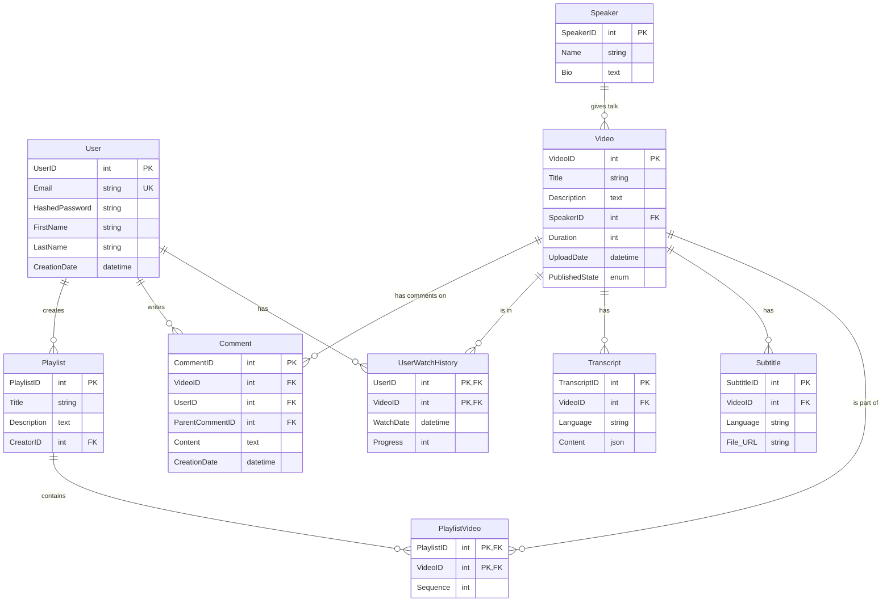
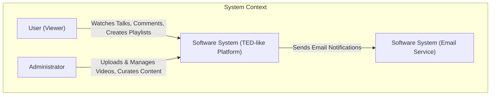
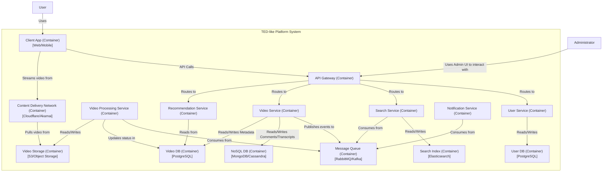
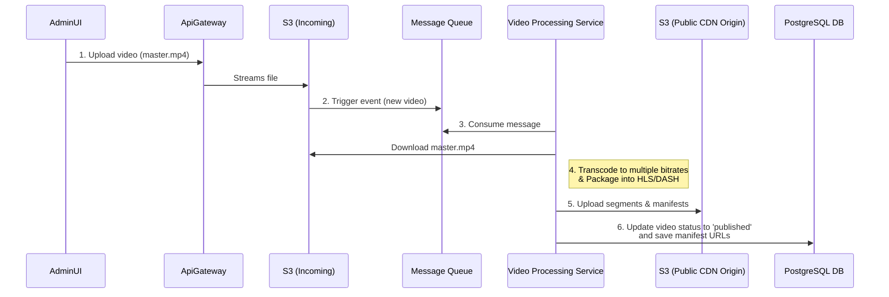
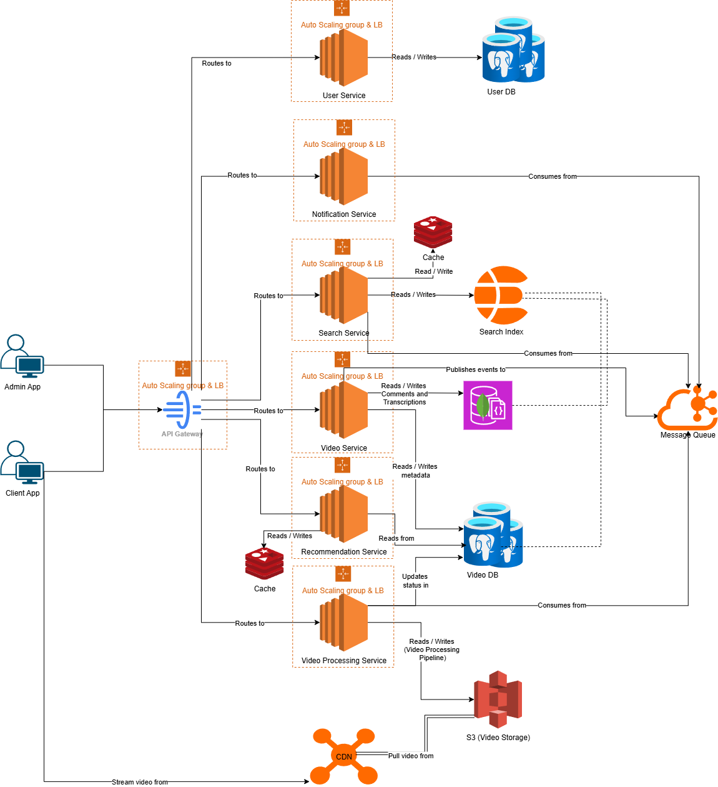

# TED-like Video Platform System Design

Let's design a video streaming platform similar to [TED](https://www.ted.com), known for its high-quality, curated educational content.

## 1. Purpose: What is a TED-like Platform?

A TED-like platform is a global content platform dedicated to sharing "ideas worth spreading" in the form of short, powerful talks (typically 18 minutes or less). It provides a vast library of videos from expert speakers on a wide range of subjects, from science and technology to arts and global issues. The core purpose is to make high-quality educational content accessible to a global audience.

## 2. Scope & Requirements Engineering

Our system should meet the following requirements:

### Functional Requirements (FRs)

-   **Video Playback:** Users can stream videos smoothly across various devices (web, mobile).
-   **Video Upload (Admin):** A secure interface for administrators to upload, manage, and publish video content.
-   **Content Discovery:** Users can search for talks by topic, speaker, or keyword.
-   **Curated Playlists & Recommendations:** Users can browse curated playlists and receive personalized recommendations.
-   **User Accounts:** Users can create accounts to save favorites, watch history, and manage preferences.
-   **Transcripts:** Interactive, time-synced transcripts are available for all talks.
-   **Subtitles:** Support for multiple language subtitles.
-   **Comments & Discussion:** Users can comment on talks and engage in discussions.

### Non-Functional Requirements (NFRs)

-   **High Availability:** The platform must be highly available to serve a global audience 24/7.
-   **Low Latency:** Video start-up time should be minimal, and seeking/scrubbing should be fast.
-   **Scalability:** The architecture must scale to handle millions of concurrent viewers and a growing library of video content.
-   **Durability:** Uploaded video content and user data must be stored durably and never be lost.
-   **Security:** Protect video content from unauthorized access/download and secure user data.
-   **Cross-Platform Consistency:** A seamless user experience across web and mobile applications.

## 3. Estimation and Constraints

Let's perform back-of-the-envelope calculations for a platform with a large, but curated, library of content.

-   **Total Videos:** Assume a library of 5,000 high-quality talks.
-   **Daily Active Users (DAU):** Let's estimate 10 million DAU.

### Traffic

-   Assume each DAU watches an average of 0.5 videos per day (some watch more, many just browse).
-   **Video Views per day:** `10 million users * 0.5 videos/day = 5 million views/day`
-   Let's assume a read/write ratio of 50:1 (viewing content is the primary action; commenting or saving favorites is less frequent).

### Requests Per Second (RPS)

-   **Read RPS (Video Streaming):** `5 million views / (24 * 3600s) = ~60 RPS` (This is for starting streams. The actual segment requests will be much higher).
-   **Write RPS (Comments, Likes, etc.):** `60 RPS / 50 = ~1.2 RPS`

### Storage

-   **Source Video Storage:** Assume each 18-minute talk is uploaded as a high-quality source file of ~2 GB.
    `5,000 videos * 2 GB/video = 10 TB`
-   **Transcoded Video Storage:** Each source video is transcoded into multiple bitrates (e.g., 1080p, 720p, 480p, 360p). Let's assume the transcoded versions total ~1.5x the source file size.
    `10 TB * 1.5 = 15 TB`
-   **Total Video Storage:** `10 TB (source) + 15 TB (transcoded) = 25 TB`
-   **Metadata & User Data Storage:** (Transcripts, comments, user profiles) is negligible compared to video storage. Let's estimate 1 TB for this.
-   **Total Storage (10 years):** Assuming the library grows by 500 new talks per year.
    `New video storage/year = 500 talks * (2 GB + 3 GB) = 2.5 TB/year`
    `Total Storage (10 years) = 25 TB (initial) + (2.5 TB/year * 10 years) = 50 TB`

### Bandwidth

-   **Egress (Read) Bandwidth:** Assume an average video bitrate of 3 Mbps (a mix of HD and SD streams).

    `5 million views/day * 18 min/view * 60 s/min * 3 Mbps = 16,200,000 Gb/day`

    `16,200,000 Gb/day / 8 bits/byte = 2,025,000 GB/day`
    
    `2,025,000 GB/day / (24 * 3600s) = ~23.5 GB/s`

-   **Ingress (Write) Bandwidth:** This is primarily for admin uploads, which is not a continuous load and can be considered negligible for overall bandwidth planning compared to egress.

### High-level estimate

| Type | Estimate |
| :--- | :--- |
| Read RPS (Stream Starts) | ~60/s |
| Write RPS | ~1/s |
| Storage (10 years) | ~50 TB |
| Egress Bandwidth | ~23.5 GB/s |

## 4. Data Model Design

In a microservices architecture, each service should own its data to ensure loose coupling. Therefore, we will partition our database. For our platform, a relational database like PostgreSQL is a good choice for the core metadata, which requires strong consistency (video details, user accounts, speakers). The User Service will have its own User DB, and the Video Service will have its own Video DB. Both will use PostgreSQL for strong consistency. For high-volume, semi-structured data like comments and transcripts, a NoSQL database could be used, but for this ERD, we'll model it relationally for clarity. The ERD below represents the combined logical model, but physically, these tables will be in separate databases.

Here is the data model which reflects our requirements:



We have the following tables:

-   **User:** Stores user account information.
-   **Speaker:** Contains details about the speakers.
-   **Video:** The central table for video metadata, linking to the speaker.
-   **Comment:** Stores user comments on videos, with a self-reference for threaded discussions.
-   **Transcript:** Holds the time-synced transcript for each video, likely as a JSON object.
-   **Subtitle:** Manages different language subtitle files for videos.
-   **Playlist & PlaylistVideo:** Manages curated playlists and the videos within them.
-   **UserWatchHistory:** Tracks user viewing progress and history.

## 5. API Design

We will design a RESTful API for client-server communication. The API will be organized by resource type. Here are some of the API endpoints:

### User & Auth APIs

```http
# User Authentication
POST /api/v1/auth/register
POST /api/v1/auth/login
POST /api/v1/auth/logout

# User Profile
GET    /api/v1/users/me
PUT    /api/v1/users/me
```

### Video & Content APIs

```http
# Get a list of videos (e.g., for the homepage)
GET /api/v1/videos

# Get details for a specific video
GET /api/v1/videos/{videoId}

# Get the transcript for a video
GET /api/v1/videos/{videoId}/transcript

# Get subtitles for a video
GET /api/v1/videos/{videoId}/subtitles?lang=en

# Get streaming manifest (HLS/DASH)
GET /api/v1/videos/{videoId}/stream
```

### Search APIs

```http
# Universal Search
GET /api/v1/search?q={query}

# Search by specific type
GET /api/v1/search/videos?q={query}
GET /api/v1/search/speakers?q={query}
```

### User Interaction APIs

```http
# Comments
GET    /api/v1/videos/{videoId}/comments
POST   /api/v1/videos/{videoId}/comments
DELETE /api/v1/comments/{commentId}

# Playlists
GET    /api/v1/users/me/playlists
POST   /api/v1/users/me/playlists
GET    /api/v1/playlists/{playlistId}
PUT    /api/v1/playlists/{playlistId}
DELETE /api/v1/playlists/{playlistId}

# Add/remove video from a playlist
POST   /api/v1/playlists/{playlistId}/videos
DELETE /api/v1/playlists/{playlistId}/videos/{videoId}

# Watch History
GET    /api/v1/users/me/history
POST   /api/v1/users/me/history  // Body: { videoId, progress }
```

## 6. High-Level Architecture

We will adopt a microservices architecture to ensure scalability and clear separation of concerns. Each service will be independently deployable and will own its data.

-   **API Gateway:** A single entry point for all client requests. It handles authentication, rate limiting, and routes traffic to the appropriate downstream service.
-   **User Service:** Manages user profiles, authentication, and account settings.
-   **Video Service:** Manages video metadata, speaker information, playlists, and comments.
-   **Search Service:** Provides a unified search experience across talks, speakers, and topics. It uses a dedicated search engine like Elasticsearch.
-   **Recommendation Service:** Generates personalized video recommendations for users.
-   **Video Processing Service:** An asynchronous pipeline that handles the ingestion, transcoding, and preparation of video files for streaming.
-   **Notification Service:** Sends notifications to users about new content or discussions.

### C4 Model Analysis

Here's how we can model the system using the C4 model.

### Level 1: System Context Diagram

This diagram shows the TED-like platform as a black box, interacting with users and external systems.



### Level 2: Container Diagram

This diagram zooms into the platform, showing its main containers (services, databases, etc.).



## 7. Detailed Design

Let's take a closer look at the most complex component of our system: the video processing pipeline.

### Video Processing Pipeline (Architectural Deep Dive)

The process of uploading a video and making it ready for streaming is complex and resource-intensive. It must be handled asynchronously to avoid blocking the user (in this case, the administrator) and to allow for scalable, parallel processing.

Here is the step-by-step workflow:

1.  **Upload:** An administrator uploads a high-resolution source video file (e.g., `master.mp4`) via the Admin UI. The API Gateway streams this file directly to a dedicated S3 bucket, the **Incoming Bucket**.
2.  **Trigger Processing:** Upon successful upload to the Incoming Bucket, an event is automatically triggered (e.g., using S3 Events) and published to a **Message Queue** (like RabbitMQ or Kafka). The message contains metadata about the uploaded file, such as its location and `videoId`.
3.  **Transcoding:** The **Video Processing Service**, a set of scalable worker nodes, consumes the message from the queue. One of the workers picks up the job and begins the transcoding process using a tool like **FFmpeg**. The worker:
    *   Downloads the source video from the Incoming Bucket.
    *   Transcodes the video into multiple resolutions and bitrates (e.g., 1080p, 720p, 480p) to enable Adaptive Bitrate Streaming (ABS).
    *   Generates thumbnails from the video.
4.  **Packaging:** The worker then packages the transcoded videos into standardized streaming formats. We will support both **HLS** and **DASH** to ensure broad device compatibility.
    *   The video segments (e.g., `.ts` for HLS, `.m4s` for DASH) and manifest files (`.m3u8` for HLS, `.mpd` for DASH) are created.
5.  **Store & Distribute:** The worker uploads all the generated assets (video segments, manifests, thumbnails) to the final **Public Storage Bucket**. This bucket is configured as the origin for our **Content Delivery Network (CDN)**.
6.  **Update Metadata:** Once all assets are successfully uploaded, the worker sends a final message to another queue or calls the Video Service API to update the video's status in the **PostgreSQL Database**. The status is changed from `processing` to `published`, and the URLs to the HLS and DASH manifests are saved.
7.  **Playback:** When a user clicks play on their device, the client application requests the streaming manifest from the CDN. The video player then uses the manifest to request the appropriate video segments based on the user's current network conditions, providing a smooth playback experience.

Here is a diagram illustrating the pipeline:



### Content Delivery Network (CDN)

Using a CDN is critical for a global video platform. It pushes our video content to edge locations around the world, closer to our users. This significantly reduces latency (faster video start times) and offloads the bandwidth burden from our origin servers, dramatically improving scalability and user experience.

## 8. Scalability and Resilience

To ensure the platform can grow and remain highly available, we will incorporate several advanced strategies.

### Data Partitioning (Sharding)

As our user base and content library grow, the main PostgreSQL database could become a bottleneck. To scale it horizontally, we will need to partition (or shard) the data. We can start with a **sharding strategy based on `UserID`**. For example, users with even `UserID`s go to one database shard, and users with odd `UserID`s go to another. This distributes user-related data like profiles, comments, and playlists. Video metadata, which is read frequently by all users, could be replicated across shards or handled with a separate scaling strategy.

### Caching

We will implement a multi-layered caching strategy to reduce latency and database load:

-   **CDN:** As discussed, the CDN will cache video segments and static assets (thumbnails, JS/CSS) at the edge.
-   **In-Memory Cache (Redis/Memcached):** We will use a distributed cache to store frequently accessed data, such as:
    -   Hot video metadata (details of the most popular talks).
    -   User session information.
    -   Pre-computed recommendation lists.
-   **Cache Eviction Policy:** A **Least Recently Used (LRU)** policy is a good starting point, as it will keep the most popular and recent content in the cache.

### Geo-Blocking

To comply with content licensing agreements that may restrict talks to certain regions, we will implement geo-blocking. This can be done at the CDN level or at the API Gateway.

1.  The user's IP address is used to determine their geographical location.
2.  When a request for a video stream comes in, a check is performed against the video's allowed regions.
3.  If the user's region is not on the allow list, the CDN or API Gateway will block the request and return an appropriate error.

### Identifying and Resolving Bottlenecks

To prevent single points of failure and ensure resilience, we will:

-   **Run Multiple Instances:** Each microservice will run with multiple instances behind a load balancer.
-   **Load Balancing:** Introduce load balancers at every layer: between clients and the API Gateway, and between the gateway and the internal services.
-   **Database Replication:** Use a primary-replica setup for our PostgreSQL database. All writes go to the primary, while reads can be distributed across multiple read replicas. This improves read performance and provides a hot standby if the primary fails.
-   **Asynchronous Communication:** The use of a message queue for video processing already decouples our services. We can extend this for other non-critical operations like sending notifications or updating analytics, making the system more resilient to failures in those specific services.


