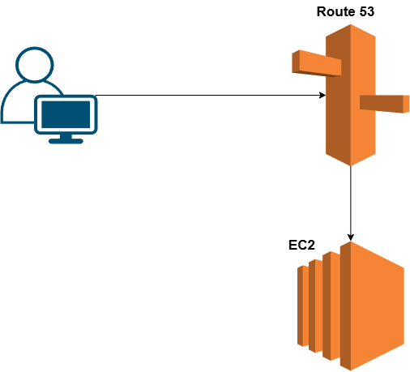
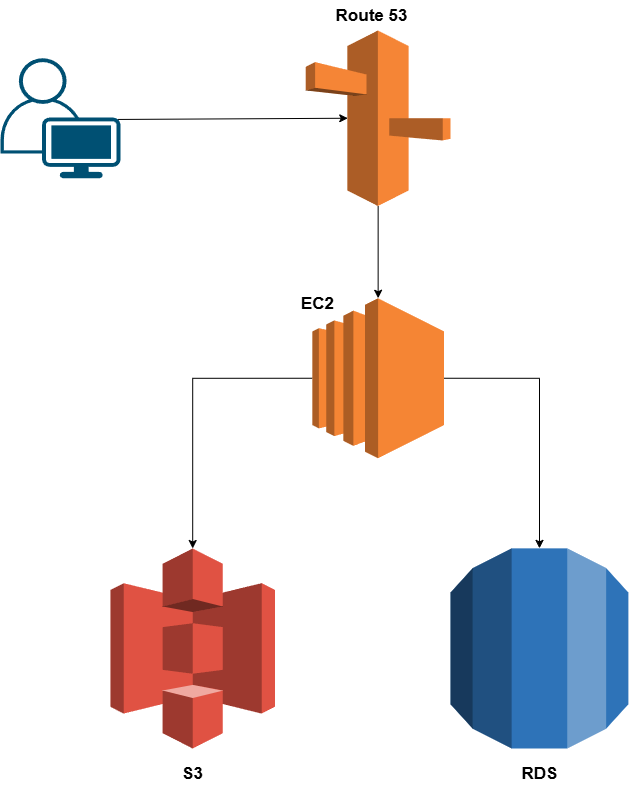
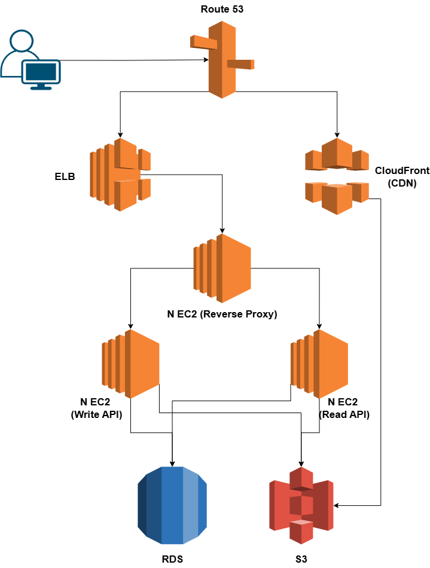
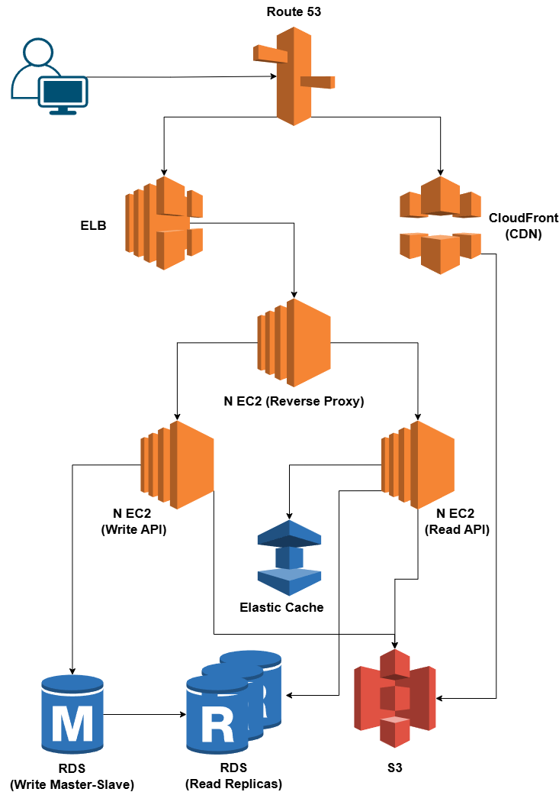
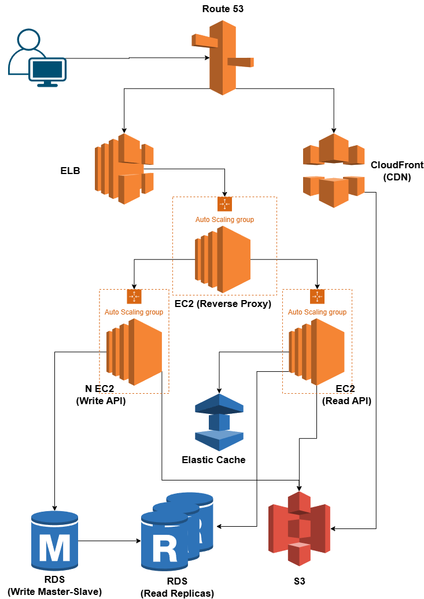
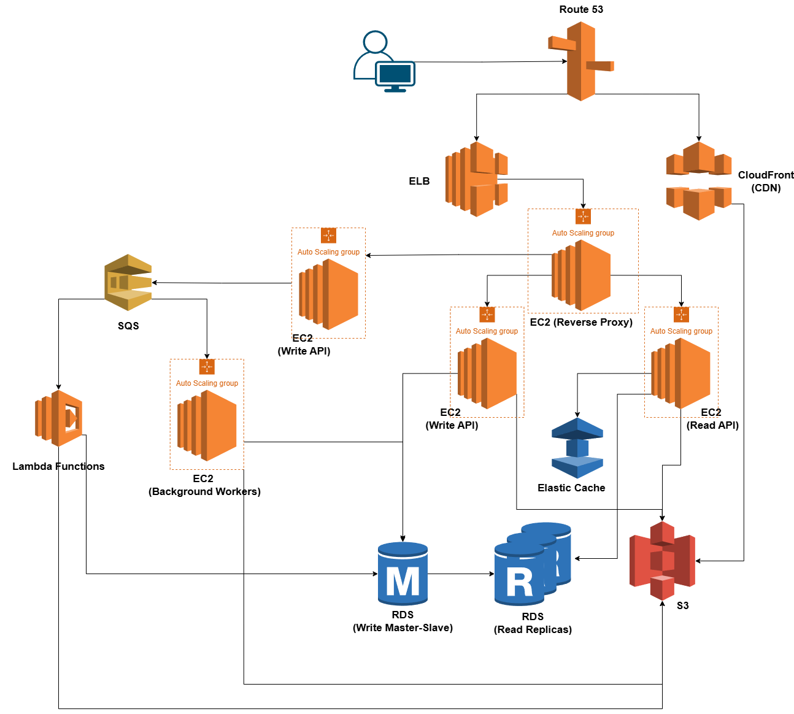
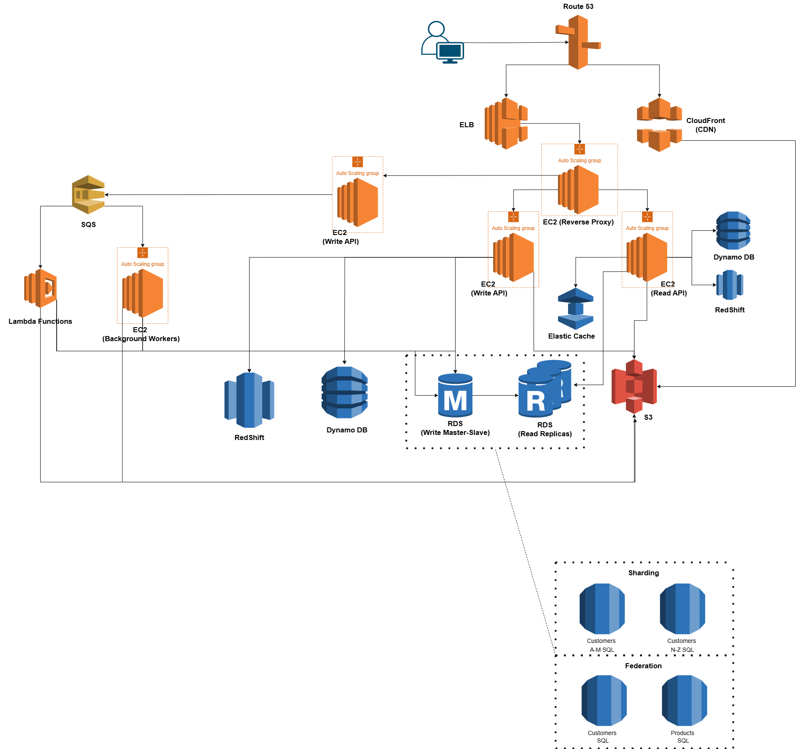

# A Guide to Scaling Systems on AWS

This guide follows an iterative approach to scaling a system from a single user to millions. The core methodology is to **Benchmark**, **Profile** for bottlenecks, address them, and repeat.

## Step 1: Outline Use Cases and Constraints

First, define the scope of the system.

### Use Cases
*   **Core Functionality:** The service accepts read/write requests, processes them, stores data, and returns a result.
*   **Scalability:** The architecture must evolve from a small user base to millions.
*   **Availability:** The service must be highly available.

### Constraints and Assumptions
*   **Traffic Pattern:** Traffic is not evenly distributed.
*   **Data Model:** The data is relational.
*   **Scale Targets:** 10 million users, 1 billion writes/month, 100 billion reads/month (100:1 read-to-write ratio).

## Step 2: Initial Design - The Single Server

For a small number of users, a simple, single-server setup is sufficient.

### Core Components
*   **Web Server:** An EC2 instance running the application logic.
*   **Database:** A PostgreSQL/MySQL database running on the same EC2 instance.
*   **DNS:** Route 53 to map a domain to the server's IP.
*   **IP Address:** An Elastic IP to ensure a stable, public IP address.

### Scaling and Security
*   **Scaling Method:** Vertical Scaling (i.e., increasing the EC2 instance size). This is simple but becomes expensive and has no redundancy.
*   **Security:** Restrict access by opening only necessary ports (80, 443, and 22 for SSH from whitelisted IPs).

---

## Step 3: Scaling the Design - An Iterative Approach

As traffic grows, we address bottlenecks in phases.

### Phase 1: Decoupling the System (Users+)

**Problem:** The single server is overloaded by the application and database competing for resources.

**Goal:** Allow for independent scaling of components.

#### Solutions:
1.  **Store Static Content Separately:**
    *   **Action:** Move static assets (JS, CSS, images, user files) to an object store.
    *   **AWS Service:** Amazon S3.
    *   **Benefit:** Reduces load on the web server, highly scalable and reliable.
2.  **Move Database to a Separate Box:**
    *   **Action:** Migrate the PostgreSQL/MySQL database to a managed service.
    *   **AWS Service:** Amazon RDS.
    *   **Benefit:** Simplifies administration and scaling, enables multi-AZ for redundancy.
3.  **Secure the System:**
    *   **Action:** Create a Virtual Private Cloud (VPC) with a public subnet for the web server and a private subnet for the database.

### Phase 2: Horizontal Scaling for High Availability (Users++)

**Problem:** The single web server is a bottleneck during peak hours and a single point of failure.

**Goal:** Improve availability and handle increasing traffic by scaling horizontally.

#### Solutions:
1.  **Add a Load Balancer:**
    *   **Action:** Distribute traffic across multiple web servers.
    *   **AWS Service:** Elastic Load Balancer (ELB).
2.  **Use Multiple Web Servers:**
    *   **Action:** Add more EC2 instances to the web tier, spread across multiple Availability Zones.
3.  **Separate Web and Application Tiers:**
    *   **Action:** Create separate server groups for web servers (acting as reverse proxies) and application servers (handling business logic) for independent scaling.
4.  **Add a Content Delivery Network (CDN):**
    *   **Action:** Cache static and dynamic content closer to users.
    *   **AWS Service:** Amazon CloudFront.
    *   **Benefit:** Reduces latency and offloads the origin servers.

### Phase 3: Optimizing for Read-Heavy Traffic (Users+++)

**Problem:** The database suffers from high read traffic (100:1 read/write ratio).

**Goal:** Reduce database load and improve response times.

#### Solutions:
1.  **Add a Memory Cache:**
    *   **Action:** Cache frequently accessed content and user session data in memory.
    *   **AWS Service:** Amazon ElastiCache.
    *   **Benefit:** Reduces read latency and makes web servers stateless, enabling autoscaling.
2.  **Add Database Read Replicas:**
    *   **Action:** Create read-only copies of the PostgreSQL/MySQL database to serve read traffic.
    *   **Benefit:** Reduces load on the write master database.

### Phase 4: Automating for Efficiency (Users++++)

**Problem:** Traffic spikes cause performance issues, and manual scaling is inefficient.

**Goal:** Automate scaling to handle traffic spikes and reduce costs.

#### Solutions:
1.  **Add Autoscaling:**
    *   **Action:** Automatically add or remove servers based on load.
    *   **AWS Service:** Auto Scaling Groups, triggered by CloudWatch metrics (CPU load, latency, etc.).
2.  **Automate DevOps:**
    *   **Action:** Use tools like Chef, Puppet, or Ansible for configuration management.
3.  **Enhance Monitoring:**
    *   **Action:** Implement comprehensive monitoring, logging, and alerting using services like CloudWatch, CloudTrail, PagerDuty, and Sentry.

### Phase 5: Decoupling with Asynchronous Workflows (Users+++++)

**Problem:** Long-running tasks (like sending emails or processing video) block the main application thread, leading to slow user-facing responses.

**Goal:** Improve application responsiveness and resilience by handling time-consuming operations in the background.

#### Solutions:
1.  **Implement Asynchronous Workflows:**
    *   **Action:** Decouple long-running tasks from the main application.
    *   **AWS Service:** Use Amazon SQS (Simple Queue Service) to queue jobs for background workers (running on EC2 or Lambda).

### Phase 6: Scaling the Database for Extreme Workloads (Users++++++)

**Problem:** A single write-master database cannot handle the write volume, and the dataset is becoming too large for a single instance.

**Goal:** Scale the data tier to handle massive throughput and storage requirements.

#### Solutions:
1.  **Scale the SQL Database Further:**
    *   **Action:** Employ advanced SQL scaling patterns like **Federation** (splitting by function), **Sharding** (partitioning by key), or **Denormalization**.
2.  **Introduce NoSQL:**
    *   **Action:** For specific use cases (e.g., high-volume writes, unstructured data), migrate parts of the system to a NoSQL database.
    *   **AWS Service:** Amazon DynamoDB.
3.  **Add a Data Warehouse:**
    *   **Action:** For very large datasets, store historical data in a data warehouse for analytics.
    *   **AWS Service:** Amazon Redshift.

---

## System Scaling Points

*   **SQL Scaling Patterns:**
    *   **Read replicas:** Create copies of the database to handle read traffic, reducing load on the primary database.
    *   **Federation:** Split databases by function or service, allowing them to be scaled independently.
    *   **Sharding:** Partition data by a specific key across multiple databases to distribute the load.
    *   **Denormalization:** Add redundant data to tables to avoid costly joins and improve read performance.
    *   **SQL Tuning:** Optimize SQL queries and database indexes to improve execution speed.
*   **NoSQL:**
    *   **Key-value stores:** Use a simple key-to-value mapping for fast lookups, ideal for caching or session storage.
    *   **Document stores:** Store data in flexible, JSON-like documents, suitable for varied or evolving data structures.
    *   **Wide column stores:** Organize data into tables, rows, and dynamic columns, optimized for queries over large datasets.
    *   **Graph databases:** Use nodes and edges to represent and query complex relationships between data points.
*   **Caching:**
    *   **Client caching:** Store data directly in the user's browser to avoid making redundant network requests.
    *   **CDN caching:** Cache content at edge locations globally to reduce latency for users.
    *   **Web server caching:** Store pre-rendered content on the web server to serve requests faster.
    *   **Database caching:** Keep frequently accessed query results in memory to reduce database load.
    *   **Application caching:** Store frequently used data within the application's memory for quick access.
*   **Asynchronism:**
    *   **Message queues:** Allow services to communicate asynchronously, improving reliability and decoupling systems.
    *   **Task queues:** Manage background jobs and long-running tasks without blocking the user interface.
    *   **Back pressure:** Provide a mechanism for a system to resist being overwhelmed by incoming requests.
    *   **Microservices:** Build an application as a collection of small, independent services that communicate over a network.
*   **Communications:**
    *   **REST vs. RPC:** Choose between a standardized, stateless protocol (REST) or a more direct, function-call-based protocol (RPC) for service communication.
    *   **Service discovery:** Enable services to find and communicate with each other automatically in a dynamic environment.

---

## Scaling with Containers (ECS and EKS)

Containerization provides a powerful approach to scaling applications. AWS offers two primary container orchestration services, each with distinct scaling mechanisms.

### Scaling on Amazon ECS (Elastic Container Service)

Amazon ECS is a fully managed service where you do not have to manage a control plane. Scaling is handled at two levels: the service level (containers/tasks) and the cluster level (EC2 instances).

*   **Service Auto Scaling:** This adjusts the number of tasks for your service. It works for both EC2 and Fargate launch types and supports multiple scaling policies:
    *   **Target Tracking:** Scales based on a target value for a metric like average CPU or memory utilization.
    *   **Step Scaling:** Scales based on a set of adjustments that vary depending on the size of the alarm breach.
    *   **Scheduled Scaling:** Scales based on a specific date and time.

*   **Cluster Auto Scaling (for EC2 launch type):** This adjusts the number of EC2 instances in your cluster. It uses **ECS Capacity Providers** to link the cluster to an EC2 Auto Scaling group, ensuring the right number of instances are running to meet the resource needs of your tasks.

### Scaling on Amazon EKS (Elastic Kubernetes Service)

Amazon EKS manages the availability and scalability of the Kubernetes control plane for you. Scaling the worker nodes and the pods running on them is achieved through a combination of Kubernetes-native tools.

*   **Pod-Level Scaling (Scaling the Application):**
    *   **Horizontal Pod Autoscaler (HPA):** Automatically scales the number of pods in a deployment based on CPU utilization or custom metrics.
    *   **Vertical Pod Autoscaler (VPA):** Adjusts the CPU and memory resource requests and limits for a pod's containers based on historical usage, helping to right-size your applications.
    *   **KEDA (Kubernetes-based Event Driven Autoscaler):** An open-source tool that scales the number of pods based on external event sources like the number of messages in a queue.

*   **Node-Level Scaling (Scaling the Infrastructure):**
    *   **Kubernetes Cluster Autoscaler:** Automatically adjusts the number of worker nodes in the cluster to ensure all pods have a place to run without having unnecessary nodes.
    *   **Karpenter:** An open-source, flexible, high-performance cluster autoscaler that directly launches right-sized nodes in response to application needs, often leading to better efficiency and lower costs compared to the standard Cluster Autoscaler.
